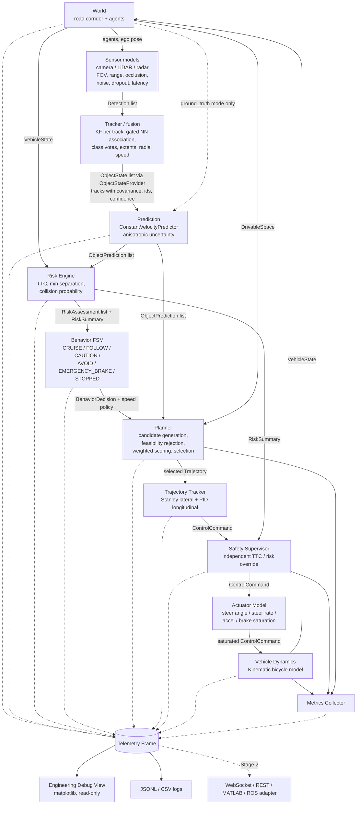

# Architecture — Closed-Loop Autonomy Core with Simulated Multi-Sensor Perception

Project: SIH26037 — Adaptive Path Planning and Collision Avoidance for
Autonomous Vehicles on Unstructured Indian Roads.

Scope: a genuine closed-loop simulation in which simulated camera, LiDAR and
radar observe the world, a tracker fuses their detections into object tracks,
a planner produces a trajectory, a controller converts it into steering /
acceleration / braking, actuator limits shape the command, and a bicycle model
determines motion. No ML (object classes come from the simulated camera's
noisy classifier, not from a network), no polished UI. `perception.mode` in
`config/sensors.yaml` switches between `sensors` (the system) and
`ground_truth` (the Stage 1 baseline used to isolate planning behaviour).

## 1. Design principles

1. **The ego is never teleported.** Only `VehicleModel.step()` changes ego pose,
   and it only consumes a saturated `ControlCommand`.
2. **Lane markings are optional.** The planner reasons over a *drivable-space
   corridor* (left/right boundary polylines) plus a *reference direction*
   toward the goal. Nothing requires a lane centreline.
3. **Perception and ground truth enter through the same door.** The world
   exposes `ObjectState[]` via an `ObjectStateProvider`; the sensor-fusion
   tracker (`autonomy/perception/tracker.py`) implements the same provider.
   Prediction, risk, planning and control cannot tell which one is active.
4. **One module, one responsibility.** Each box below is a package with a small
   public interface so it can later map onto a Simulink subsystem or a
   Stateflow chart.
5. **Explain everything.** Every behaviour decision carries a reason string and
   the numeric triggers. Every candidate trajectory keeps its cost breakdown
   and rejection reason. Metrics are computed from executed states only.
6. **Deterministic.** Every random draw comes from a seeded generator declared
   in the scenario file.

## 2. Data flow



Two loop rates exist. The **dynamics loop** runs at `simulation.dt_s` (default
0.02 s). The **planning loop** runs at `planning.frequency_hz` (default 10 Hz).
Between planning cycles the tracker keeps following the last selected
trajectory, indexed by time since that plan was produced. The safety supervisor
and actuator model run every dynamics step.

## 3. Modules

| Package | Responsibility | Public entry point | Later replaced by |
|---|---|---|---|
| `autonomy/core` | Data contracts, geometry (oriented boxes, SAT, distances), config loading, enums | `types.py`, `geometry.py`, `config.py` | Simulink bus definitions |
| `autonomy/vehicle` | Vehicle parameters, actuator saturation, kinematic bicycle model | `VehicleModel.step()` | Dynamic bicycle model / Vehicle Dynamics Blockset |
| `autonomy/perception` | Multi-object tracker and sensor fusion: KF per track, gated nearest-neighbour association, lifecycle, class/extent/velocity fusion, duplicate merge | `SensorFusionTracker.ingest()` / `.get_object_states()` | JPDA / learned association behind the same provider |
| `simulation/sensors` | Camera / LiDAR / radar models with FOV, range, occlusion, noise, dropout, update rate, latency | `SensorSuite.sense()` | Automated Driving Toolbox sensors / RoadRunner |
| `autonomy/prediction` | Time-indexed predicted positions with growing anisotropic uncertainty | `Predictor.predict()` | Learned or interaction-aware predictor |
| `autonomy/risk` | Distance, closing speed, TTC, min predicted separation, intersection, collision probability, risk level | `RiskEngine.evaluate()` | Same interface, richer models |
| `autonomy/behavior` | Finite state machine with declared transition table, hysteresis, explanation | `BehaviorStateMachine.decide()` | Stateflow chart |
| `autonomy/planning` | Candidate generation in corridor frame, collision sweep, boundary check, scoring, selection | `Planner.plan()` | Lattice/MPC planner behind same interface |
| `autonomy/control` | Stanley lateral + PID longitudinal, target-point lookup | `TrajectoryTracker.track()` | MPC |
| `autonomy/safety` | Independent emergency-brake override with activation log | `SafetySupervisor.check()` | AEB block |
| `autonomy/metrics` | Metrics from executed states; hooks for Stage 2 metrics | `MetricsCollector.update()` | — |
| `autonomy/telemetry` | Per-cycle `TelemetryFrame`; publisher and sinks (memory, JSONL, console) | `TelemetryPublisher.publish()` | WebSocket/REST/MATLAB adapter |
| `simulation/world` | Drivable-space corridor, Frenet projection, ground-truth object provider | `DrivableSpace`, `World` | RoadRunner scene + sensors |
| `simulation/agents` | Generic dynamic agent with behaviour profiles | `Agent`, `AgentBehavior.update()` | Scenario traffic from Driving Scenario Designer |
| `simulation/scenarios` | YAML scenario definitions and loader | `load_scenario()` | — |
| `simulation/runner.py` | Closed-loop orchestration | `Simulation.run()` | Simulink model |
| `visualization` | Read-only matplotlib debugger over telemetry frames | `debug_view.py` | Hackathon dashboard |

## 4. Coordinate frames and units

* World frame: right-handed, x east, y north, yaw counter-clockwise from +x.
  Metres, seconds, radians, m/s, m/s². Degrees appear only in config files and
  console output; conversion happens at load time.
* Corridor (Frenet) frame: `s` = arc length along the *reference polyline*
  (goal direction, not a lane marking), `d` = signed lateral offset, positive to
  the left of travel direction. `DrivableSpace.project()` and `to_cartesian()`
  convert between frames. Left and right boundaries are independent polylines,
  so width may vary and the corridor need not be symmetric about the reference.
* Vehicle pose is the centre of gravity (CG). The footprint rectangle centre is
  offset from CG by `wheelbase/2 - lr` along the heading.

## 5. Vehicle model

**Actuator model** (applied before dynamics, every dynamics step):

```
delta_target = clip(delta_cmd, -delta_max, delta_max)
delta[k+1]   = delta[k] + clip(delta_target - delta[k], -ddelta_max*dt, ddelta_max*dt)
a_net        = clip(a_cmd - b_cmd, -a_brake_max, a_accel_max)
```

**Kinematic bicycle model** (CG reference, forward Euler at dt = 0.02 s;
integration scheme isolated so RK4 can be switched on later):

```
beta   = atan( lr / (lf + lr) * tan(delta) )
x_dot  = v * cos(psi + beta)
y_dot  = v * sin(psi + beta)
psi_dot= v * cos(beta) * tan(delta) / L
v_dot  = a_net,        v in [0, v_max]
v_lat  = v * sin(beta)        (reported for interface completeness)
```

A `DynamicBicycleModel` (tyre slip, yaw inertia) can implement the same
`VehicleModel` interface; the controller and planner see only `VehicleState`.

## 5b. Sensors and fusion

Sensor models (`simulation/sensors/models.py`) convert ground-truth agents into
`Detection`s in the world frame, per sensor at its own rate, with field of
view, range, line-of-sight occlusion by other agents' footprints, Gaussian
noise in the sensor's natural coordinates (bearing/range for camera and
radar, x/y for LiDAR), dropout probability and delivery latency:

| Sensor | Measures | Noise model | Notes |
|---|---|---|---|
| Camera | bearing, range, class + confidence | σ_bearing, σ_range = frac·range + min; class confusion 1 − accuracy | 100° FOV, 60 m |
| LiDAR | x, y, length, width, heading | isotropic σ_pos, σ_extent, σ_heading | 360°, 80 m |
| Radar | range, bearing, radial speed | σ_range, coarse σ_bearing, σ_ṙ; small objects dropped more often | 60° FOV, 120 m |

The tracker (`autonomy/perception/tracker.py`) keeps one Kalman filter per
track, state [x, y, vx, vy], constant-velocity model with acceleration process
noise. Position measurements from all three sensors update it with their own
covariance; radar radial speed is an EKF update. Association is gated nearest
neighbour (Mahalanobis, χ² gate) per sensor batch. Tracks are tentative until
`confirm_hits`, deleted after `max_misses` or `max_age_s`, and duplicates that
gate on each other are merged. Class = confidence-weighted camera votes
(UNKNOWN without camera), dimensions = LiDAR extents, heading = velocity when
moving else LiDAR. Published `ObjectState`s carry the filter covariance, and
downstream margins grow with it (`uncertainty_margin_gain`). Ablations that
must change the output are unit-tested: no camera → UNKNOWN classes; no radar
→ larger velocity covariance; no LiDAR → larger positional covariance.

## 6. Prediction model

Constant acceleration over `prediction.acceleration_horizon_s`, then constant
velocity, to `prediction.horizon_s` at `prediction.dt_s`. Neither the ground-truth
provider nor the tracker's constant-velocity Kalman filter reports acceleration, so
the predictor estimates it itself: a per-object history of the last
`velocity_history_s` of velocity samples, least-squares slope, first-order filter
(`acceleration_filter_s`), clamped to a per-class limit (`max_acceleration_by_type`,
else `max_acceleration_mps2`). With fewer than `min_history_samples` the estimate is
exactly zero, so the model degrades to constant velocity rather than guessing.

Speed is propagated signed and never reverses sign: a decelerating pedestrian comes
to a stop and stays there. Road followers get the acceleration along the corridor
only; free movers (`follows_road: false`) get it along their heading, plus an intent
prior that shrinks the along-heading uncertainty growth when they are braking
(`intent_stopping_growth_factor`) and grows it when they are speeding up. Setting
`prediction.estimate_acceleration: false` restores pure constant velocity.

Positional standard deviation grows with time using the object's behaviour profile,
anisotropically:

```
sigma_l^2(t) = sigma_pos0^2 + f_s^2 [ (sigma_vel t)^2 + (0.5 sigma_acc t^2)^2 ]   along the heading
sigma_t(t)   = lateral_factor * sigma_l(t)                                       across the heading
f_s          = static_factor while the object is (near) stationary, else 1
```

Road-following vehicles have small lateral factors (0.3–0.45), pedestrians and
cattle 1.0. The initial term is max(profile σ₀², tracked covariance). The risk
engine and scorer project the covariance onto the direction toward the ego
(`ObjectPrediction.sigma_toward`). Profiles live in `config/object_profiles.yaml`.

## 7. Risk model

Three ego motions are compared against every object's predicted footprint
(oriented-box distance at each prediction time `t_k`):

| View | Ego motion | Used by |
|---|---|---|
| **route** | follow the corridor at the current lateral offset at the *desired* speed | behaviour levels CAUTION / AVOID, `RiskAssessment` list |
| **physical** | constant velocity along the *current heading* at the current speed ("if control froze now") | `min_ttc_current_speed`; the only source of CRITICAL; safety supervisor |
| **plan** | the currently selected trajectory | `plan_*` aggregates (is the chosen plan clear?) |

The route view is what makes the behaviour layer see a threat *before* the
planner has reacted and *while* it is reacting: "if I proceeded on my route at
the desired speed, would I hit something?" The physical view is the honest
"am I about to hit something right now" signal; a stopped vehicle has infinite
physical TTC, so it can never be "emergency braked".

Per object:

* `min_predicted_distance`, `time_of_min_distance`
* `trajectory_intersection` = any `t_k` with distance <= safety margin (route view)
* `ttc` (route), `ttc_physical` (current heading and speed), `ttc_kinematic` = d(0) / closing speed.
  A TTC is the earliest `t_k` at which the footprints come within the margin *while closing*
  (a constant sub-margin distance alongside an object is not a TTC) or truly overlap.
* `collision_probability(t)` = band probability (`autonomy/core/probability.py`):
  `Phi((gap + W)/sigma) - Phi(gap/sigma)`, gap = max(d - margin, 0),
  W = ego width + object size + 2 margin; 1 when footprints overlap. Unlike a
  Gaussian density ratio it tends to 0 as uncertainty grows, so far-future
  uncertainty does not freeze the planner.
* `risk_score` = `w_type * max_t [ p(t) * exp(-t/tau) ]`
* `risk_level`: NONE/LOW/MEDIUM/HIGH from `risk_score` thresholds, escalated to
  HIGH when the route TTC < `ttc_high_s`; CRITICAL only when the physical TTC
  < `ttc_critical_s`.

`RiskSummary` aggregates the worst object, min TTC per view, and a *lead
object* (traffic ahead inside the ego's lateral band) for FOLLOW.

## 8. Behaviour state machine

States: CRUISE, FOLLOW, CAUTION, AVOID, EMERGENCY_BRAKE, STOPPED, REVERSING.
Transitions are declared in one table (`behavior/state_machine.py:TRANSITIONS`)
with guard functions over `RiskSummary`, ego speed and planner feasibility.
Escalations are immediate; de-escalations respect `min_dwell_s` and lower exit
thresholds (hysteresis).

| Transition | Guard (summary) |
|---|---|
| any moving state -> EMERGENCY_BRAKE | physical TTC < critical, or planner has no feasible trajectory |
| EMERGENCY_BRAKE -> STOPPED | vehicle stationary |
| EMERGENCY_BRAKE -> CAUTION | no longer CRITICAL and planner feasible |
| STOPPED -> AVOID / CAUTION | vehicle moves off on a clear plan / risk subsides |
| STOPPED -> REVERSING | boxed in: stationary for `reverse_after_standstill_s` with no forward plan, and fewer than `max_reverse_manoeuvres` legs used |
| REVERSING -> CAUTION | back at rest and a forward plan exists again, or `reverse_timeout_s` elapsed |
| CRUISE, FOLLOW, CAUTION -> AVOID | route intersection predicted and level >= HIGH |
| AVOID -> CAUTION | no intersection and score < `avoid_exit_score` |
| CRUISE, FOLLOW -> CAUTION | level >= MEDIUM |
| CRUISE, CAUTION -> FOLLOW | slower lead object in the ego band |
| CAUTION, FOLLOW -> CRUISE | score < `caution_exit_score`, no intersection |

Speed policy per state: CRUISE desired speed; FOLLOW gap-controlled lead
speed; CAUTION `caution_speed_factor`; AVOID `avoid_speed_factor` with lateral
candidates enabled; EMERGENCY_BRAKE stop-only candidates; STOPPED caution
speed with lateral candidates so the planner can find a way out while the
zero-speed candidate remains available; REVERSING caution speed with
`allow_reverse` set, which is the only state in which the planner emits reversing
candidates. Every `BehaviorDecision` carries a reason string and the numeric
triggers.

**Reversing recovery.** A vehicle stopped a few metres in front of an obstacle can
be geometrically unable to steer around it: the quintic's peak curvature ties a
lateral shift of `w` metres to roughly `sqrt(5.77 w / (0.8 kappa_max))` metres of
forward travel, about 9 m for a 3 m shift, which is more room than the stop standoff
leaves. The planner reports that state (no forward candidate that makes progress),
the behaviour layer enters REVERSING, and the planner commits to the longest clear
reversing leg out of `planning.reverse_distances_m`, re-planning the remaining
distance each cycle until the leg is done. One leg per REVERSING episode; the
episode ends when a forward plan reappears, and `reverse_count` resets on CRUISE.
`NARROW_LANE_BOXED_IN` is the scenario that exercises it end to end.

## 9. Planner

1. **Frame**: project ego pose to `(s0, d0, theta_rel)`.
2. **Candidates**: for every lateral end offset `d_end` and every terminal speed
   in the speed set derived from the behaviour speed policy, build
   * lateral profile: quintic polynomial `d(s)` from `(d0, d0', d0'')` to
     `(d_end, 0, 0)` over a transition length, then hold. The offsets span the whole
     drivable width on a `lateral_step_m` grid anchored on the desired offset, plus
     both corridor extremes (the grid quantises them away, and squeezing past an
     obstacle is exactly when they are needed). The transition length is
     `max(v0*T_lat, S_min, S_kappa, S_alat)`, where `S_kappa` keeps the quintic's
     peak curvature `5.77*shift/S^2` inside the steering limit and `S_alat` keeps
     `v0^2*kappa` inside the lateral-acceleration comfort limit, so wide shifts are
     stretched rather than rejected;
   * longitudinal profile: jerk-limited S-curve from `v0` to `v_end`. The
     acceleration starts at the ego's current acceleration, ramps toward
     `a_accel_max` / comfortable deceleration at most `max_jerk_mps3` per second and
     is wound back to reach `v_end` with zero acceleration. Seeding from the current
     acceleration matters because the planner re-plans at 10 Hz and the controller
     tracks the first samples of each new profile. The hard-stop candidate keeps the
     instantaneous full-braking ramp: safety beats comfort;
   * in REVERSING only, straight reversing legs at the current offset: a trapezoid
     in reverse speed from the current one up to `reverse_speed_mps`, ending at rest
     after the committed distance;
   * sample every `planning.dt_s` over `planning.horizon_s`, convert to
     Cartesian, compute yaw, curvature, acceleration.
3. **Hard feasibility rejection** (recorded with reason, evaluated for all
   candidates in one batched numpy pass): `|kappa| > tan(delta_max)/L`,
   `v^2*|kappa| > a_lat_max`, footprint outside the corridor at any time or
   closer than `boundary_margin_m` after `boundary_margin_grace_s` (the current
   pose is not the planner's choice), predicted collision with any object
   (footprint distance <= `safety_margin_m` at the same time index).
   Boundary clearance uses the candidates' corridor coordinates against
   `RoadModel.lateral_bounds(s)` (exact on straights, ~6 cm error at R = 60 m,
   tested against the polygon geometry); the geometric path remains the
   fallback for trajectories without corridor coordinates.
4. **Scoring** of feasible candidates:

```
J = w_collision*C_collision + w_clearance*C_clearance + w_smoothness*C_smooth
  + w_curvature*C_curv + w_progress*C_progress + w_boundary*C_boundary
  + w_speed*C_speed + w_uncertainty*C_uncert + w_lateral*C_lateral
  + w_blocked*C_blocked + w_front_pass*C_front_pass + w_consistency*C_consistency
  + w_jerk*C_jerk
```

Each component is normalised to roughly [0, 1] and documented in
`planning/scorer.py`. `w_lateral` (deviation from the reference direction) is
an addition to the prompt's list and is what makes the vehicle return toward
its route after an avoidance.

5. **Beyond the horizon**: each surviving candidate is continued along the
   corridor at its terminal speed (frozen for a stop) up to `route_lookahead_s`
   against constant-velocity extrapolations of all objects. The continuation keeps
   the lateral rate the candidate ended with, up to its target offset, instead of
   freezing `d`: a wide shift outlasts the 4 s horizon, so freezing it would make
   every candidate that is half-way around an obstacle look like it drives into
   it. A meeting before
   `terminal_exposure_horizon_s` rejects the candidate (`TERMINAL_STATE_EXPOSED`:
   "do not stop where you will be hit, do not creep toward a blocked route");
   a later meeting adds the graded `blocked` cost. Near-stop candidates must
   also come to rest at least `stop_standoff_m` from every object (now and
   predicted) so a bypass remains possible from standstill. Being inside the
   margin counts as a hit only while the distance is still shrinking, and the
   first `collision_margin_grace_s` excuses the current pose.
6. **Anti-freeze**: while the ego stands still under planner control, the
   progress weight grows with waiting time (`standstill_progress_gain`) so a
   feasible bypass eventually outweighs waiting. The mirror image is the **creep
   guard**: a candidate that violates a margin or the standoff is only admitted to
   the degraded tier if it does not end closer to the object than simply holding
   position would (allowing for the distance a comfortable stop needs). Without it
   the degraded tier walks the ego into an obstacle a few centimetres per cycle and
   hides the fact that it is stuck.
7. **Boxed in**: at rest, within `boxed_in_range_m` of a static blocker, with every
   progressing candidate aiming at an offset that still overlaps it, and yet room to
   pass beside it, the planner reports no forward plan. That is what triggers the
   reversing recovery in section 8. Candidates are judged by the offset they aim at,
   not the one they have reached by the end of the horizon.
8. **Selection**: minimum `J` among feasible candidates. The `consistency` term
   (change of lateral end offset against the previously selected plan) is what keeps
   the choice stable: neighbouring offsets differ by very little and the cost
   landscape moves every cycle as tracks appear and drop, so without it the car
   flips from one side of the road to the other several times a second. The previous
   offset is remembered across hard-stop fallbacks, because the ego is still
   physically on that line. If nothing is feasible but some candidates
   are collision-free and on the road (only margin, standoff or beyond-horizon
   exposure violated) the cheapest of those is selected and flagged `degraded=True`.
   Otherwise the maximum-deceleration stop trajectory is returned flagged
   `fallback=True`; behaviour and safety supervisor treat that as an emergency.
   Reversing legs are selected ahead of forward candidates only while the behaviour
   layer is in REVERSING.

## 10. Controller

* **Lateral — Stanley with look-ahead and curvature feed-forward**: front-axle
  cross-track error `e` at the nearest trajectory point, heading error
  `theta_e` and path curvature `kappa` at a look-ahead point
  `max(lookahead_time_s * v, min_lookahead_m)` ahead;
  `delta = theta_e + atan(k*e / (k_soft + v)) + atan(L * kappa)`, clipped to
  `delta_max`. Because the planner re-plans from the ego pose every cycle the
  nearest point always has ~zero error; the look-ahead and feed-forward are
  what bend the vehicle onto the path.
* **Longitudinal — PID**: target speed from the trajectory at the current time
  offset plus the trajectory's feed-forward acceleration; output split into
  `acceleration >= 0` and `brake >= 0`.
* Both expose their target point / errors for the debug view.

## 11. Safety supervisor

Runs after the tracker every dynamics step. Overrides to maximum braking
(steering held) when the physical TTC `min_ttc_current_speed < ttc_critical_s`,
the risk level is CRITICAL, or the planner returned a fallback, and the
vehicle is moving. Holds the override for `safety.hold_time_s` to avoid
chattering. Every activation is recorded with time and reason and counted in
metrics. It does not depend on the planner's choices.

## 12. Simulation loop

```
while running:
    objects      = world.object_provider.get_object_states(t)
    if planning cycle due:
        predictions = predictor.predict(objects, t)
        risks       = risk_engine.evaluate(ego, ego_reference, objects, predictions)
        decision    = behavior.decide(risks, ego, t)
        plan        = planner.plan(ego, decision, predictions, road, t)
    control = tracker.track(ego, plan.selected, t)
    control = safety.check(control, risks, plan, ego, t)
    ego     = vehicle.step(ego, control, dt)          # actuator limits inside
    world.update(dt, ego)
    metrics.update(...)
    telemetry.publish(frame)
```

Termination: goal reached, collision (configurable stop), or timeout.

## 13. Testing strategy

* `tests/unit`: dynamics (straight-line integration, steady-state turn radius),
  steering rate saturation, acceleration saturation, SAT overlap and distance,
  corridor containment/projection, prediction growth, TTC, candidate rejection,
  scoring monotonicity, Stanley convergence, PID convergence, FSM transitions,
  safety override.
* `tests/integration`: planner + tracker + vehicle on an empty corridor
  converge to the reference with bounded error.
* `tests/scenarios`: SUDDEN_CATTLE_CROSSING asserts `collisions == 0`,
  `completed == True`, `min_clearance >= safety_margin`, that the cattle really
  crossed the ego band, that the FSM passed through AVOID and returned to
  CRUISE, that candidates were rejected and scored, and that the ego was never
  teleported (per-step displacement <= v_max*dt, actuator limits respected).
  SUDDEN_PEDESTRIAN_DART additionally asserts that the safety supervisor fired
  and that the EMERGENCY_BRAKE state was visited and recovered from.
  MIXED_TRAFFIC_CURVE asserts curve following inside the corridor, the merge
  and road-following of the auto-rickshaw, bit-identical replay of the seeded
  erratic pedestrian, use of FOLLOW without chatter, and the planner latency
  budget (mean < planning period, p95 < 1.5x).
* `tests/scenarios/test_parameter_sweep.py`: a 3x2 grid over cattle crossing
  speed and trigger distance must be collision-free with the margin held
  (`scripts/sweep.py` prints the same table as a success rate).

## 14. Dependencies

| Dependency | Why | Why not an alternative |
|---|---|---|
| Python 3.11 | Rapid Stage 1 iteration; prompt allows non-MATLAB Stage 1 | MATLAB not installed on the dev machine; Stage 2 target |
| numpy | Vectorised trajectory / prediction arrays and geometry | Pure Python too slow for 10 Hz planning over ~50 candidates × 40 steps × N objects |
| PyYAML | Configuration and scenario files | JSON lacks comments; TOML stdlib is read-only |
| matplotlib | Engineering debug view only; imported lazily | Any web UI would couple the core to a frontend |
| pytest | Tests | stdlib unittest is verbose |

Deliberately excluded: shapely (own SAT keeps geometry portable to MATLAB),
pydantic (dataclasses suffice), any web framework, any ML library.

## 15. MATLAB / Simulink mapping (Stage 2)

Each package maps to one subsystem; `types.py` dataclasses map to Simulink
buses; `behavior/state_machine.py` maps to a Stateflow chart; `world/` is
replaced by RoadRunner + Automated Driving Toolbox sensors feeding a fusion
block that implements `ObjectStateProvider`.

## 16. Live dashboard sink

`autonomy/telemetry/dashboard.py: DashboardSink` is the "WebSocket / REST"
adapter box of section 2, implemented as one more `TelemetrySink` with the
standard library only. It runs a `ThreadingHTTPServer` in a daemon thread and
serves a self-contained HTML/JS/canvas page (`dashboard_page.py`), a
Server-Sent-Events stream of compact frames (`/stream`, throttled to ~10 Hz
wall-clock, one bounded queue per client, oldest frame dropped for slow
clients), `/latest` and `/metrics`. Compact frames are derived from the
dataclasses' own `to_dict()` methods (`compact_frame`); candidates are strided
and reduced to their x/y polylines. `close()` flushes the final frame and a
`done` event but keeps serving so the end state stays inspectable;
`shutdown()` releases the port. `RealtimePacingSink` sleeps in `write()` so a
run advances at wall-clock speed; it is registered last so every other sink has
already seen the frame. Nothing in the core imports either sink; the loop is
unchanged.

## 17. MATLAB / Simulink export (untested in MATLAB)

`matlab_export/` generates `matlab/` from the Python sources so the Stage 2
Simulink model starts from the same contracts: `buses.m` (`Simulink.Bus`
objects introspected from `VehicleState`, `ControlCommand`, `ObjectState`,
`RiskSummary`, `SpeedPolicy`, `BehaviorDecision`, `SimulationMetrics`, with
enums as `int32` and a code table), `behavior_transitions.{m,csv}` and
`behavior_states.csv` (the FSM's `TRANSITIONS` table and `SEVERITY`, one
Stateflow transition per row), and `replay_telemetry.m` (loads a JSONL log with
`jsondecode`, plots speed / steering / state timeline / clearance and asserts
the invariants of section 13). No MATLAB installation was available: the
generated MATLAB code has not been executed and is labelled accordingly.
