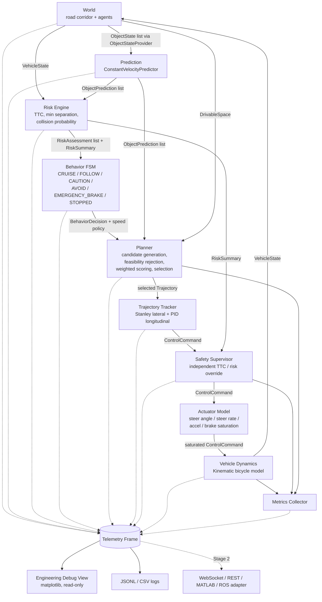

# Architecture — Stage 1 Closed-Loop Autonomy Core

Project: SIH26037 — Adaptive Path Planning and Collision Avoidance for
Autonomous Vehicles on Unstructured Indian Roads.

Stage 1 scope: a genuine closed-loop simulation in which a planner produces a
trajectory, a controller converts it into steering / acceleration / braking,
actuator limits shape the command, and a bicycle model determines motion.
No perception, no ML, no polished UI.

## 1. Design principles

1. **The ego is never teleported.** Only `VehicleModel.step()` changes ego pose,
   and it only consumes a saturated `ControlCommand`.
2. **Lane markings are optional.** The planner reasons over a *drivable-space
   corridor* (left/right boundary polylines) plus a *reference direction*
   toward the goal. Nothing requires a lane centreline.
3. **Ground truth enters through the same door as perception.** The world
   exposes `ObjectState[]` via an `ObjectStateProvider`. Stage 2 sensor fusion
   implements the same provider; prediction/risk/planning are untouched.
4. **One module, one responsibility.** Each box below is a package with a small
   public interface so it can later map onto a Simulink subsystem or a
   Stateflow chart.
5. **Explain everything.** Every behaviour decision carries a reason string and
   the numeric triggers. Every candidate trajectory keeps its cost breakdown
   and rejection reason. Metrics are computed from executed states only.
6. **Deterministic.** Every random draw comes from a seeded generator declared
   in the scenario file.

## 2. Data flow



Two loop rates exist. The **dynamics loop** runs at `simulation.dt_s` (default
0.02 s). The **planning loop** runs at `planning.frequency_hz` (default 10 Hz).
Between planning cycles the tracker keeps following the last selected
trajectory, indexed by time since that plan was produced. The safety supervisor
and actuator model run every dynamics step.

## 3. Modules

| Package | Responsibility | Public entry point | Later replaced by |
|---|---|---|---|
| `autonomy/core` | Data contracts, geometry (oriented boxes, SAT, distances), config loading, enums | `types.py`, `geometry.py`, `config.py` | Simulink bus definitions |
| `autonomy/vehicle` | Vehicle parameters, actuator saturation, kinematic bicycle model | `VehicleModel.step()` | Dynamic bicycle model / Vehicle Dynamics Blockset |
| `autonomy/prediction` | Time-indexed predicted positions with growing uncertainty | `Predictor.predict()` | Learned or interaction-aware predictor |
| `autonomy/risk` | Distance, closing speed, TTC, min predicted separation, intersection, collision probability, risk level | `RiskEngine.evaluate()` | Same interface, richer models |
| `autonomy/behavior` | Finite state machine with declared transition table, hysteresis, explanation | `BehaviorStateMachine.decide()` | Stateflow chart |
| `autonomy/planning` | Candidate generation in corridor frame, collision sweep, boundary check, scoring, selection | `Planner.plan()` | Lattice/MPC planner behind same interface |
| `autonomy/control` | Stanley lateral + PID longitudinal, target-point lookup | `TrajectoryTracker.track()` | MPC |
| `autonomy/safety` | Independent emergency-brake override with activation log | `SafetySupervisor.check()` | AEB block |
| `autonomy/metrics` | Metrics from executed states; hooks for Stage 2 metrics | `MetricsCollector.update()` | — |
| `autonomy/telemetry` | Per-cycle `TelemetryFrame`; publisher and sinks (memory, JSONL, console) | `TelemetryPublisher.publish()` | WebSocket/REST/MATLAB adapter |
| `simulation/world` | Drivable-space corridor, Frenet projection, ground-truth object provider | `DrivableSpace`, `World` | RoadRunner scene + sensors |
| `simulation/agents` | Generic dynamic agent with behaviour profiles | `Agent`, `AgentBehavior.update()` | Scenario traffic from Driving Scenario Designer |
| `simulation/scenarios` | YAML scenario definitions and loader | `load_scenario()` | — |
| `simulation/runner.py` | Closed-loop orchestration | `Simulation.run()` | Simulink model |
| `visualization` | Read-only matplotlib debugger over telemetry frames | `debug_view.py` | Hackathon dashboard |

## 4. Coordinate frames and units

* World frame: right-handed, x east, y north, yaw counter-clockwise from +x.
  Metres, seconds, radians, m/s, m/s². Degrees appear only in config files and
  console output; conversion happens at load time.
* Corridor (Frenet) frame: `s` = arc length along the *reference polyline*
  (goal direction, not a lane marking), `d` = signed lateral offset, positive to
  the left of travel direction. `DrivableSpace.project()` and `to_cartesian()`
  convert between frames. Left and right boundaries are independent polylines,
  so width may vary and the corridor need not be symmetric about the reference.
* Vehicle pose is the centre of gravity (CG). The footprint rectangle centre is
  offset from CG by `wheelbase/2 - lr` along the heading.

## 5. Vehicle model

**Actuator model** (applied before dynamics, every dynamics step):

```
delta_target = clip(delta_cmd, -delta_max, delta_max)
delta[k+1]   = delta[k] + clip(delta_target - delta[k], -ddelta_max*dt, ddelta_max*dt)
a_net        = clip(a_cmd - b_cmd, -a_brake_max, a_accel_max)
```

**Kinematic bicycle model** (CG reference, forward Euler at dt = 0.02 s;
integration scheme isolated so RK4 can be switched on later):

```
beta   = atan( lr / (lf + lr) * tan(delta) )
x_dot  = v * cos(psi + beta)
y_dot  = v * sin(psi + beta)
psi_dot= v * cos(beta) * tan(delta) / L
v_dot  = a_net,        v in [0, v_max]
v_lat  = v * sin(beta)        (reported for interface completeness)
```

A `DynamicBicycleModel` (tyre slip, yaw inertia) can implement the same
`VehicleModel` interface; the controller and planner see only `VehicleState`.

## 6. Prediction model

Constant velocity and heading over `prediction.horizon_s` at
`prediction.dt_s`. Positional standard deviation grows with time using the
object's behaviour profile:

```
sigma^2(t) = sigma_pos0^2 + (sigma_vel * t)^2 + (0.5 * sigma_acc * t^2)^2
```

Profiles live in `config/object_profiles.yaml` (per object type: dimensions,
sigma values, risk weight). The planner never sees object types directly; it
sees predicted positions, covariances and per-object risk weights.

## 7. Risk model

Three ego motions are compared against every object's predicted footprint
(oriented-box distance at each prediction time `t_k`):

| View | Ego motion | Used by |
|---|---|---|
| **route** | follow the corridor at the current lateral offset at the *desired* speed | behaviour levels CAUTION / AVOID, `RiskAssessment` list |
| **physical** | follow the corridor at the *current* speed | `min_ttc_current_speed`; the only source of CRITICAL; safety supervisor |
| **plan** | the currently selected trajectory | `plan_*` aggregates (is the chosen plan clear?) |

The route view is what makes the behaviour layer see a threat *before* the
planner has reacted and *while* it is reacting: "if I proceeded on my route at
the desired speed, would I hit something?" The physical view is the honest
"am I about to hit something right now" signal; a stopped vehicle has infinite
physical TTC, so it can never be "emergency braked".

Per object:

* `min_predicted_distance`, `time_of_min_distance`
* `trajectory_intersection` = any `t_k` with distance <= safety margin (route view)
* `ttc` (route), `ttc_physical` (current speed), `ttc_kinematic` = d(0) / closing speed
* `collision_probability(t)` = band probability (`autonomy/core/probability.py`):
  `Phi((gap + W)/sigma) - Phi(gap/sigma)`, gap = max(d - margin, 0),
  W = ego width + object size + 2 margin; 1 when footprints overlap. Unlike a
  Gaussian density ratio it tends to 0 as uncertainty grows, so far-future
  uncertainty does not freeze the planner.
* `risk_score` = `w_type * max_t [ p(t) * exp(-t/tau) ]`
* `risk_level`: NONE/LOW/MEDIUM/HIGH from `risk_score` thresholds, escalated to
  HIGH when the route TTC < `ttc_high_s`; CRITICAL only when the physical TTC
  < `ttc_critical_s`.

`RiskSummary` aggregates the worst object, min TTC per view, and a *lead
object* (traffic ahead inside the ego's lateral band) for FOLLOW.

## 8. Behaviour state machine

States: CRUISE, FOLLOW, CAUTION, AVOID, EMERGENCY_BRAKE, STOPPED.
Transitions are declared in one table (`behavior/state_machine.py:TRANSITIONS`)
with guard functions over `RiskSummary`, ego speed and planner feasibility.
Escalations are immediate; de-escalations respect `min_dwell_s` and lower exit
thresholds (hysteresis).

| Transition | Guard (summary) |
|---|---|
| any moving state -> EMERGENCY_BRAKE | physical TTC < critical, or planner has no feasible trajectory |
| EMERGENCY_BRAKE -> STOPPED | vehicle stationary |
| EMERGENCY_BRAKE -> CAUTION | no longer CRITICAL and planner feasible |
| STOPPED -> AVOID / CAUTION | vehicle moves off on a clear plan / risk subsides |
| CRUISE, FOLLOW, CAUTION -> AVOID | route intersection predicted and level >= HIGH |
| AVOID -> CAUTION | no intersection and score < `avoid_exit_score` |
| CRUISE, FOLLOW -> CAUTION | level >= MEDIUM |
| CRUISE, CAUTION -> FOLLOW | slower lead object in the ego band |
| CAUTION, FOLLOW -> CRUISE | score < `caution_exit_score`, no intersection |

Speed policy per state: CRUISE desired speed; FOLLOW gap-controlled lead
speed; CAUTION `caution_speed_factor`; AVOID `avoid_speed_factor` with lateral
candidates enabled; EMERGENCY_BRAKE stop-only candidates; STOPPED caution
speed with lateral candidates so the planner can find a way out while the
zero-speed candidate remains available. Every `BehaviorDecision` carries a
reason string and the numeric triggers.

## 9. Planner

1. **Frame**: project ego pose to `(s0, d0, theta_rel)`.
2. **Candidates**: for every lateral end offset `d_end` in
   `planning.lateral_offsets_m` and every terminal speed in the speed set
   derived from the behaviour speed policy, build
   * lateral profile: quintic polynomial `d(s)` from `(d0, d0', d0'')` to
     `(d_end, 0, 0)` over a transition length `max(v0*T_lat, S_min)`, then hold;
   * longitudinal profile: `v(t)` ramp from `v0` to `v_end` under
     `a_accel_max` / comfortable deceleration, integrated to `s(t)`;
   * sample every `planning.dt_s` over `planning.horizon_s`, convert to
     Cartesian, compute yaw, curvature, acceleration.
3. **Hard feasibility rejection** (recorded with reason, evaluated for all
   candidates in one batched numpy pass): `|kappa| > tan(delta_max)/L`,
   `v^2*|kappa| > a_lat_max`, footprint outside the corridor at any time or
   closer than `boundary_margin_m` after `boundary_margin_grace_s` (the current
   pose is not the planner's choice), predicted collision with any object
   (footprint distance <= `safety_margin_m` at the same time index).
4. **Scoring** of feasible candidates:

```
J = w_collision*C_collision + w_clearance*C_clearance + w_smoothness*C_smooth
  + w_curvature*C_curv + w_progress*C_progress + w_boundary*C_boundary
  + w_speed*C_speed + w_uncertainty*C_uncert + w_lateral*C_lateral
```

Each component is normalised to roughly [0, 1] and documented in
`planning/scorer.py`. `w_lateral` (deviation from the reference direction) is
an addition to the prompt's list and is what makes the vehicle return toward
its route after an avoidance.

5. **Selection**: minimum `J` among feasible candidates. If none is feasible
   but some are collision-free and on the road (only the boundary *margin* is
   violated) the cheapest of those is selected and flagged `degraded=True`.
   Otherwise the maximum-deceleration stop trajectory is returned flagged
   `fallback=True`; behaviour and safety supervisor treat that as an emergency.

## 10. Controller

* **Lateral — Stanley with look-ahead and curvature feed-forward**: front-axle
  cross-track error `e` at the nearest trajectory point, heading error
  `theta_e` and path curvature `kappa` at a look-ahead point
  `max(lookahead_time_s * v, min_lookahead_m)` ahead;
  `delta = theta_e + atan(k*e / (k_soft + v)) + atan(L * kappa)`, clipped to
  `delta_max`. Because the planner re-plans from the ego pose every cycle the
  nearest point always has ~zero error; the look-ahead and feed-forward are
  what bend the vehicle onto the path.
* **Longitudinal — PID**: target speed from the trajectory at the current time
  offset plus the trajectory's feed-forward acceleration; output split into
  `acceleration >= 0` and `brake >= 0`.
* Both expose their target point / errors for the debug view.

## 11. Safety supervisor

Runs after the tracker every dynamics step. Overrides to maximum braking
(steering held) when the physical TTC `min_ttc_current_speed < ttc_critical_s`,
the risk level is CRITICAL, or the planner returned a fallback, and the
vehicle is moving. Holds the override for `safety.hold_time_s` to avoid
chattering. Every activation is recorded with time and reason and counted in
metrics. It does not depend on the planner's choices.

## 12. Simulation loop

```
while running:
    objects      = world.object_provider.get_object_states(t)
    if planning cycle due:
        predictions = predictor.predict(objects, t)
        risks       = risk_engine.evaluate(ego, ego_reference, objects, predictions)
        decision    = behavior.decide(risks, ego, t)
        plan        = planner.plan(ego, decision, predictions, road, t)
    control = tracker.track(ego, plan.selected, t)
    control = safety.check(control, risks, plan, ego, t)
    ego     = vehicle.step(ego, control, dt)          # actuator limits inside
    world.update(dt, ego)
    metrics.update(...)
    telemetry.publish(frame)
```

Termination: goal reached, collision (configurable stop), or timeout.

## 13. Testing strategy

* `tests/unit`: dynamics (straight-line integration, steady-state turn radius),
  steering rate saturation, acceleration saturation, SAT overlap and distance,
  corridor containment/projection, prediction growth, TTC, candidate rejection,
  scoring monotonicity, Stanley convergence, PID convergence, FSM transitions,
  safety override.
* `tests/integration`: planner + tracker + vehicle on an empty corridor
  converge to the reference with bounded error.
* `tests/scenarios`: SUDDEN_CATTLE_CROSSING asserts `collisions == 0`,
  `completed == True`, `min_clearance >= safety_margin`, that the cattle really
  crossed the ego band, that the FSM passed through AVOID and returned to
  CRUISE, that candidates were rejected and scored, and that the ego was never
  teleported (per-step displacement <= v_max*dt, actuator limits respected).
  SUDDEN_PEDESTRIAN_DART additionally asserts that the safety supervisor fired
  and that the EMERGENCY_BRAKE state was visited and recovered from.

## 14. Dependencies

| Dependency | Why | Why not an alternative |
|---|---|---|
| Python 3.11 | Rapid Stage 1 iteration; prompt allows non-MATLAB Stage 1 | MATLAB not installed on the dev machine; Stage 2 target |
| numpy | Vectorised trajectory / prediction arrays and geometry | Pure Python too slow for 10 Hz planning over ~50 candidates × 40 steps × N objects |
| PyYAML | Configuration and scenario files | JSON lacks comments; TOML stdlib is read-only |
| matplotlib | Engineering debug view only; imported lazily | Any web UI would couple the core to a frontend |
| pytest | Tests | stdlib unittest is verbose |

Deliberately excluded: shapely (own SAT keeps geometry portable to MATLAB),
pydantic (dataclasses suffice), any web framework, any ML library.

## 15. MATLAB / Simulink mapping (Stage 2)

Each package maps to one subsystem; `types.py` dataclasses map to Simulink
buses; `behavior/state_machine.py` maps to a Stateflow chart; `world/` is
replaced by RoadRunner + Automated Driving Toolbox sensors feeding a fusion
block that implements `ObjectStateProvider`.
