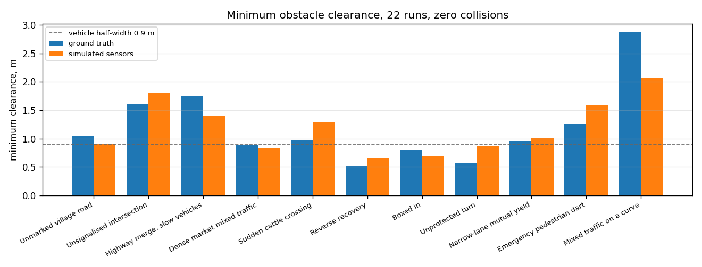
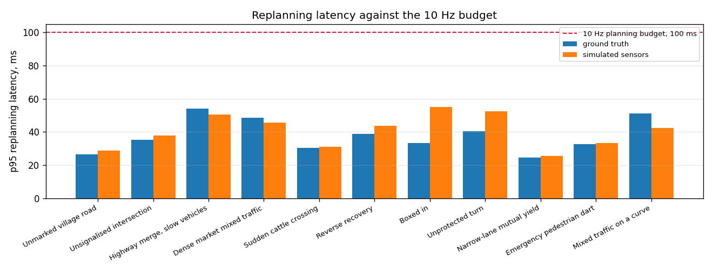
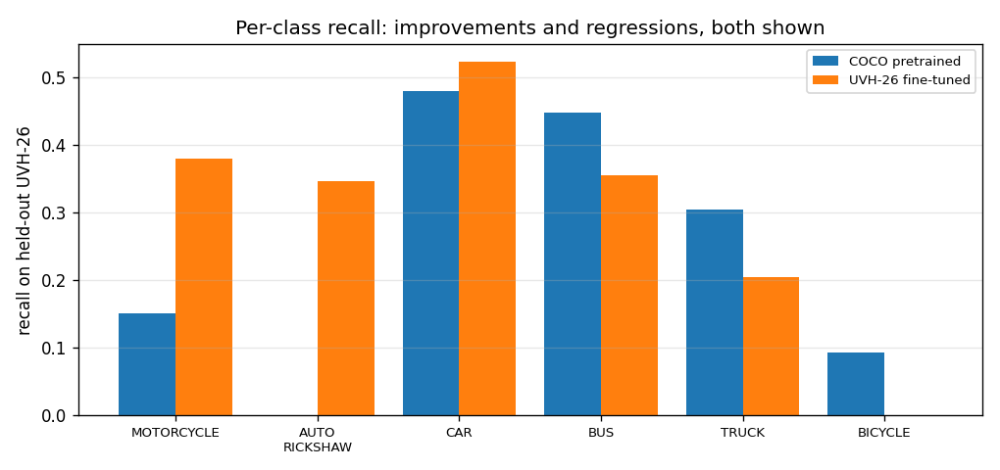

# SIH26037 — final system report

Adaptive path planning and collision avoidance for autonomous vehicles on unstructured Indian
roads. Generated from measured results by `scripts/build_final_report.py`; every number here comes
from `docs/FINAL_SYSTEM_RESULTS.json`. System frozen at commit `2ccd232a8b`.

> **What was validated, and how.** The learned detector was validated independently on held-out
> UVH-26 Indian-scene imagery, and its output contract was verified against the unmodified tracking
> pipeline. The autonomy stack was validated independently, end to end, through simulated
> multimodal sensors. These are two separate validations. The simulator renders no image frames, so
> **no detector consumed camera pixels during the closed-loop runs**, and this package does not
> claim end-to-end learned camera perception in closed loop.

## 1. Headline

| Metric | Final result |
|---|---|
| Scenarios | **11** |
| Runs | **22** |
| Completion | **22/22** |
| Collisions | **0** |
| Worst minimum clearance | **0.51 m** |
| Worst p95 replanning latency | **55.0 ms** |
| Worst single replanning latency | **189.2 ms** |
| Emergency brakes, ground truth | **0** |
| Emergency brakes, sensors | **7** |
| Tests | **348** |
| Failed tests | **0** |
| Skipped tests | **0** |

## 2. Architecture

    simulated camera / LiDAR / radar
        -> Detection contract
        -> Kalman tracking and multimodal fusion
        -> constant-acceleration prediction with intent priors
        -> time-to-collision and risk assessment
        -> behaviour state machine, 7 states
        -> corridor-frame lattice planner with quintic lateral profiles
        -> swept-footprint collision checking
        -> Stanley lateral + PID longitudinal control
        -> safety supervisor, able to override the planner
        -> kinematic bicycle model with a reverse gear
        -> world update

Full detail in `docs/TECHNICAL_ARCHITECTURE.md`.

## 3. Closed-loop results, all 22 runs

| Scenario | Mode | Goal | Collision | Min clearance | Replans | p95 replan | E-brakes |
|---|---|---|---|---|---|---|---|
| Unmarked village road | ground_truth | yes | 0 | 1.05 m | 351 | 26.3 ms | 0 |
| Unsignalised intersection | ground_truth | yes | 0 | 1.60 m | 180 | 35.3 ms | 0 |
| Highway merge, slow vehicles | ground_truth | yes | 0 | 1.75 m | 268 | 54.0 ms | 0 |
| Dense market mixed traffic | ground_truth | yes | 0 | 0.89 m | 338 | 48.4 ms | 0 |
| Sudden cattle crossing | ground_truth | yes | 0 | 0.96 m | 152 | 30.5 ms | 0 |
| Reverse recovery | ground_truth | yes | 0 | 0.51 m | 340 | 38.9 ms | 0 |
| Boxed in | ground_truth | yes | 0 | 0.80 m | 318 | 33.3 ms | 0 |
| Unprotected turn | ground_truth | yes | 0 | 0.57 m | 258 | 40.3 ms | 0 |
| Narrow-lane mutual yield | ground_truth | yes | 0 | 0.95 m | 189 | 24.6 ms | 0 |
| Emergency pedestrian dart | ground_truth | yes | 0 | 1.26 m | 119 | 32.7 ms | 0 |
| Mixed traffic on a curve | ground_truth | yes | 0 | 2.88 m | 267 | 51.2 ms | 0 |
| Unmarked village road | sensors | yes | 0 | 0.91 m | 357 | 28.6 ms | 0 |
| Unsignalised intersection | sensors | yes | 0 | 1.80 m | 183 | 37.7 ms | 0 |
| Highway merge, slow vehicles | sensors | yes | 0 | 1.40 m | 366 | 50.5 ms | 0 |
| Dense market mixed traffic | sensors | yes | 0 | 0.84 m | 433 | 45.6 ms | 3 |
| Sudden cattle crossing | sensors | yes | 0 | 1.29 m | 155 | 30.9 ms | 0 |
| Reverse recovery | sensors | yes | 0 | 0.66 m | 334 | 43.6 ms | 3 |
| Boxed in | sensors | yes | 0 | 0.69 m | 245 | 55.0 ms | 0 |
| Unprotected turn | sensors | yes | 0 | 0.87 m | 178 | 52.5 ms | 0 |
| Narrow-lane mutual yield | sensors | yes | 0 | 1.00 m | 186 | 25.4 ms | 0 |
| Emergency pedestrian dart | sensors | yes | 0 | 1.59 m | 126 | 33.1 ms | 1 |
| Mixed traffic on a curve | sensors | yes | 0 | 2.07 m | 258 | 42.3 ms | 0 |

## 4. Perception, sensor mode

Measured across the simulated-sensor runs.

| Metric | Value |
|---|---|
| Track recall | 0.865 to 0.997 |
| Track precision | 0.745 to 1.000 |
| Worst mean track position error | 0.635 m |
| Worst mean track velocity error | 0.396 m/s |
| Worst fusion latency | 62.3 ms |

## 5. Learned detector, held-out UVH-26 imagery

150 held-out images, IoU 0.5, score threshold 0.35.
Selected model: B_uvh26_finetuned (Phase 7C uniform sampling).

| Metric | COCO | UVH-26 FT | Delta |
|---|---|---|---|
| Precision | 0.536 | 0.621 | +0.084 |
| Recall | 0.226 | 0.379 | +0.153 |
| mAP at IoU 0.5 | 0.238 | 0.325 | +0.087 |
| Motorcycle recall | 0.151 | 0.379 | +0.228 |
| Auto Rickshaw recall | 0.000 | 0.347 | +0.347 |
| Car recall | 0.480 | 0.523 | +0.043 |
| Bus recall | 0.447 | 0.355 | -0.092 |
| Truck recall | 0.305 | 0.205 | -0.099 |
| Bicycle recall | 0.094 | 0.000 | -0.094 |
| Latency | 255 ms | 287 ms | +31 ms |

**Read this honestly, regressions included.**

- **Motorcycle improved** substantially, which was the baseline's worst class.
- **Auto-rickshaw became detectable at all.** COCO has no such class, so the baseline's zero is by
  construction rather than by failure.
- **Bicycle remains data-limited** at 106 training boxes. A class-aware oversampling experiment
  recovered it only from 0 to 2 detections out of 32, still below the COCO baseline's 3.
- **Truck partially recovered under oversampling** (0.205 to 0.291), but that model was **not
  selected**, because it cost mAP and motorcycle and auto-rickshaw recall.
- **Bus and truck are not uniformly improved** by the selected model.
- **UVH-26 is elevated CCTV imagery, not dashcam.** Dashcam transfer is unvalidated.

## 6. Replanning case studies

| Case | Initial TTC | Feasible candidates | Behaviour | Speed change | Final clearance | Collision |
|---|---|---|---|---|---|---|
| Sudden cattle crossing | 2.1 s | 46 of 73 | AVOID | -3.66 m/s | 1.29 m | 0 |
| Emergency pedestrian dart | 0.7 s | 1 of 2 | EMERGENCY_BRAKE + override | -5.60 m/s | 1.59 m | 0 |
| Dense market mixed traffic | 1.1 s | 1 of 2 | EMERGENCY_BRAKE + override | -0.80 m/s | 0.84 m | 0 |
| Reverse recovery | 0.3 s | 0 of 2 | EMERGENCY_BRAKE + override | -0.80 m/s | 0.66 m | 0 |

Each case was captured at that scenario's lowest physical time-to-collision, where the stack is
genuinely under pressure, rather than at a frame chosen to look good.

## 7. Safety checks

| Check | Result |
|---|---|
| no collisions in any scenario or mode | PASS |
| every scenario reached its goal | PASS |
| sensors mode uses fusion as the object provider | PASS |
| ground-truth mode uses the world provider | PASS |
| planner consumes the scenario road | PASS |
| replanning actually changes the trajectory somewhere | PASS |
| emergency braking fires where required | PASS |
| reverse recovery fires where required | PASS |

## 8. Regression

348 passed, 0 failed, 0 skipped, against a previous
baseline of 348. No test was removed or weakened.

## 9. Limitations

**The learned detector is not in the closed loop.** The simulator renders no image frames. Its
inference also costs about 287 ms against a 100 ms
planning period, so it is an offline evidence pipeline rather than a real-time front end.

**Camera-only perception is unvalidated on dashcam imagery.** UVH-26 is CCTV; the segmentation work
used still photographs with assumed calibration.

**Pedestrian and animal detection were not improved** by the fine-tuning data, which contains
neither class.

**Simulated sensors, not recorded ones.** Real-data validation covers the fusion interface
(nuScenes) and the detector (real images), not the closed loop.

**Temporal fusion ships disabled**, because enabling it makes the stack more conservative by
removing an over-confidence the collision margins were tuned against.

**Worst-case clearance is 0.51 m**, in the scenario deliberately built
to be tight for a 1.8 m vehicle.

## 10. Reproducibility

| Item | Location |
|---|---|
| Consolidated results | `docs/FINAL_SYSTEM_RESULTS.json` |
| Closed-loop validation | `scripts/final_validation.py` |
| Detector A/B | `scripts/eval_uvh26_ab.py` |
| Dataset subset manifest | `docs/uvh26_manifest.json`, seed 20260907 |
| This report | `scripts/build_final_report.py` |

Datasets are gitignored and never redistributed. **Checkpoint policy:** the Phase 7C checkpoint is
already tracked and stays; `perception_detector/checkpoints/*.pt` is now gitignored, and future
large model files should be distributed as release artefacts rather than normal git blobs. No git
history was rewritten.
