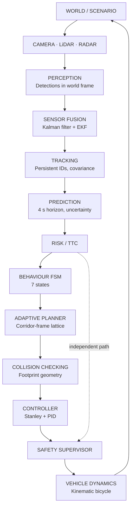
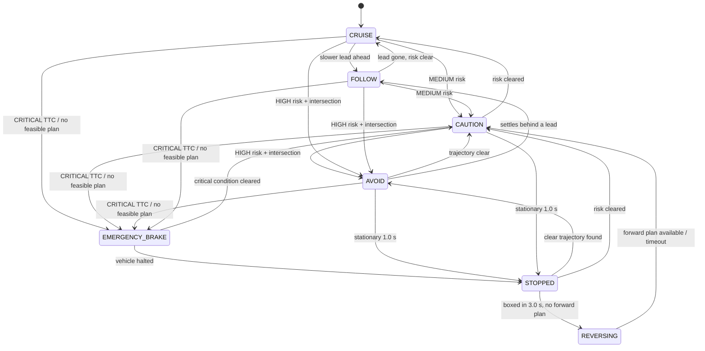
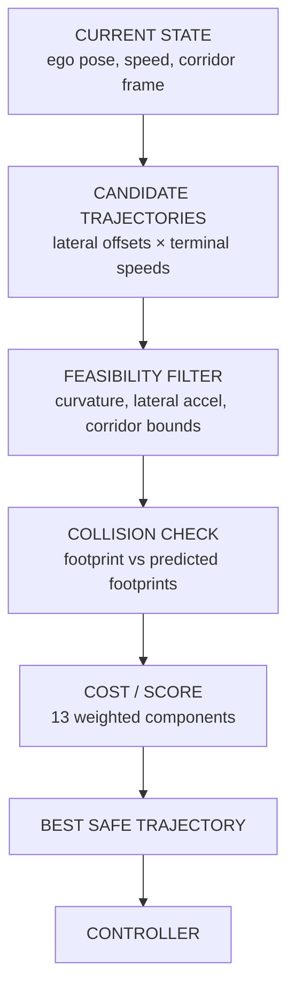
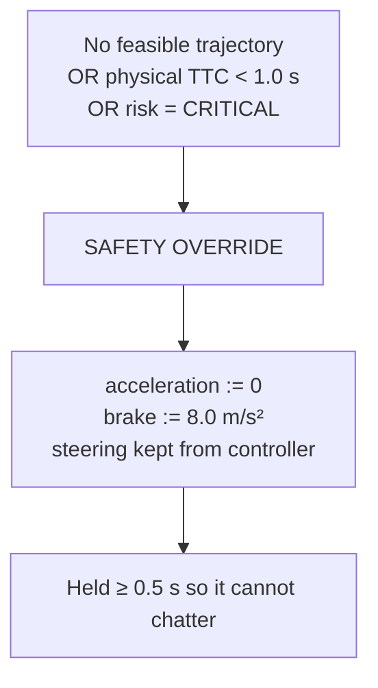
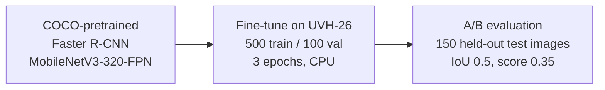

# SIH26037 — Adaptive Path Planning and Collision Avoidance for Autonomous Vehicles on Unstructured Indian Roads

**Project overview for engineers joining the team.** Read time: 10–15 minutes.

Status: autonomy implementation **frozen** at commit `2ccd232`. Evidence package generated at
`f3f8eef`. All numbers below come from `docs/FINAL_SYSTEM_RESULTS.json` or from the code itself.

---

## 1. The problem

SIH26037 asks for **adaptive path planning and collision avoidance for autonomous vehicles on
unstructured Indian roads**.

The word that carries the weight is *unstructured*. Almost all publicly available autonomous-driving
software assumes a structured road: painted lane markings, traffic that stays in its lane, and other
road users whose next move follows from a small set of rules. An Indian road frequently offers none
of that.

| What the road actually presents | Why it breaks a lane-follower |
|---|---|
| **No lane markings** at all on village and rural roads | There is no centreline to detect, so the primary input simply does not exist |
| **Mixed traffic**: motorcycles, auto-rickshaws, bicycles, cars, buses, trucks sharing one carriageway | Vehicles of very different width and speed occupy the same space; "one vehicle per lane" is meaningless |
| **Pedestrians and cattle** entering the carriageway without warning | The threat is not in a lane and never was |
| **Sudden crossings** — a cow, a child, a cyclist emerging from between parked vehicles | Requires reacting to a *predicted* path, not a current position |
| **Informal merging** — vehicles join from side roads without yielding or signalling | Right-of-way cannot be assumed from road geometry |
| **Narrow roads** where two vehicles cannot pass | Sometimes the only correct action is to reverse |
| **Irregular road edges** — the drivable area varies in width and is not symmetric | A fixed lane width is the wrong model |

**Why lane-following is insufficient, stated precisely.** A lane-following stack answers the
question *"where is the centre of my lane, and how do I stay on it?"* On an unstructured road that
question has no answer. Worse, if lane detection fails the whole stack has nothing to fall back on,
because every downstream module was written in terms of a lane. The failure is not graceful.

---

## 2. Our core idea

Instead of asking *"where is my lane?"*, the vehicle asks **"where is the drivable space, and what
is the safest useful path through it?"**

Concretely, at every planning cycle the system:

1. Understands the currently available **drivable corridor** — two road edges plus a reference
   direction toward the goal. Lane markings, if present, are an annotation nothing depends on.
2. **Predicts** where every nearby road user will be over the next few seconds.
3. Evaluates **collision risk** against those predictions.
4. Generates **many candidate trajectories** inside the corridor.
5. Discards the infeasible and the colliding, **scores** the rest, and selects the best one.
6. Hands the trajectory to a controller, which drives a vehicle model that moves the car.

Because the world has moved by the time the car has, this is not a pipeline that runs once. It runs
continuously:

```
PERCEIVE → FUSE → TRACK → PREDICT → ASSESS RISK → DECIDE
        → PLAN → CHECK COLLISION → CONTROL → MOVE → (repeat)
```

**This is a closed loop.** The vehicle's own motion changes what the sensors see next cycle, which
changes the tracks, the predictions, the risk, and therefore the plan. The plan is re-derived from
scratch **10 times per second**; the controller and vehicle dynamics update at **50 Hz**. Nothing is
scripted, and no scenario contains a pre-authored ego manoeuvre — every behaviour you observe
emerges from these modules interacting.

---

## 3. Complete system flow



**What each block does:**

**World / scenario.** A YAML file defines the road corridor, the ego's start and goal, and the other
road users with their behaviours. The world advances every 20 ms and is the only source of truth.

**Sensors.** Simulated camera, LiDAR and radar. These are *sensor models*, not renderers — each
converts ground-truth agents into noisy measurements subject to field of view, range, occlusion,
dropout, update rate and latency. The autonomy stack receives only a list of `Detection` objects.

**Perception.** Produces `Detection` records already transformed into the world frame: position,
a 2×2 positional covariance, and whatever else that sensor knows (class from camera, extent and
heading from LiDAR, radial speed from radar).

**Sensor fusion.** Combines detections from all three sensors into a single estimate per object. A
Kalman filter maintains state `[x, y, vx, vy]`; radar's radial speed enters through an extended
Kalman update.

**Tracking.** Maintains persistent object identities across frames, with a lifecycle: tentative on
first sight, confirmed after 3 hits, deleted after 1.0 s without an update. Output is a list of
`ObjectState` with real covariance.

**Prediction.** Projects each tracked object 4 s into the future with a constant-acceleration model,
growing positional uncertainty with time.

**Risk / TTC.** Evaluates the ego's predicted motion against every object's predicted footprint,
producing time-to-collision, a collision probability, and a risk level from NONE to CRITICAL.

**Behaviour FSM.** A 7-state machine that converts risk into a *policy*: what target speed to aim
for, whether lateral avoidance is allowed, whether only stopping is acceptable, whether reversing is
permitted.

**Adaptive planner.** Generates candidate trajectories inside the drivable corridor under that
policy, and selects one.

**Collision checking.** Rejects candidates that leave the corridor, exceed steering limits, or bring
the vehicle footprint within the safety margin of a predicted object footprint.

**Controller.** Stanley for steering, PID for speed. Converts the chosen trajectory into steering
angle, acceleration and brake commands.

**Safety supervisor.** Sits between controller and vehicle. It does not look at the plan's reasoning
— only at physical TTC, risk level, and whether the planner failed. It can override with full
braking.

**Vehicle dynamics.** A kinematic bicycle model with actuator saturation. **This is the only code
permitted to change the ego pose.**

---

## 4. Why each component exists

| Component | Why we need it | What we actually use |
|---|---|---|
| **Perception** | Raw sensors do not report objects; something must turn signals into measurements | Simulated camera / LiDAR / radar models emitting `Detection` in world frame |
| **Sensor fusion** | No single sensor gives position, class and velocity well; each is best at one thing | Linear Kalman filter, state `[x, y, vx, vy]`; EKF update for radar radial speed |
| **Tracking** | A detection is one instant with no identity; velocity cannot be measured from one frame | Gated greedy nearest-neighbour association, Mahalanobis gate χ² = 9.21 (2 dof), confirm after 3 hits |
| **Prediction** | Reacting to where an object *is* is already too late at 10 m/s | Constant-acceleration model, 4 s horizon, per-class uncertainty growth, intent priors |
| **Risk / TTC** | The planner needs a scalar it can act on, and the safety layer needs one it can trust | Footprint-to-footprint distance series, band collision probability, TTC, 5 risk levels |
| **Behaviour decision** | Separating *what to do* from *how to do it* keeps both auditable | Declarative FSM, 7 states, 14 transitions in one table, dual hysteresis |
| **Path planning** | The corridor admits infinitely many paths; we need one that is safe and makes progress | Corridor-frame (Frenet) lattice, quintic lateral profiles, jerk-limited speed profiles |
| **Collision checking** | A path safe at its centreline can still collide — the vehicle has width and length | Oriented-box footprints, separating-axis distance, swept over the whole horizon |
| **Controller** | A trajectory is a wish; the vehicle has inertia and steering limits | Stanley lateral with curvature feed-forward, PID longitudinal with anti-windup |
| **Vehicle dynamics** | Without real dynamics the results are meaningless | Kinematic bicycle model, actuator angle and rate saturation |
| **Safety supervisor** | If the planner is wrong, nothing downstream of the planner would catch it | Independent override on physical TTC < 1.0 s, CRITICAL risk, or planner fallback; brake 8.0 m/s² |

---

## 5. Perception

Three sensor types, because each answers a different question well and the others badly.

### Camera — *what is it?*

| | |
|---|---|
| Rate / range / FOV | 20 Hz, 60 m, 100° |
| Outputs | Position (range-dominated covariance), object class, class confidence |
| Weakness | Range is poor — monocular depth error grows with distance |

Two **learned** camera components were built and validated offline on real Indian-road imagery:

- **Drivable-space segmentation** (Fast-SCNN trained on IDD-Lite) turns a road photograph into a
  drivable-area mask, from which a corridor is extracted. That corridor can drive the real planner
  through a safety gate — the planner cannot tell it apart from a corridor loaded from YAML.
- **Object detection** (Faster R-CNN MobileNetV3-320-FPN, fine-tuned on UVH-26) detects Indian
  traffic participants including auto-rickshaws. See section 16.

### LiDAR — *where is it, and how big?*

| | |
|---|---|
| Rate / range / FOV | 10 Hz, 80 m, 360° |
| Outputs | Position with tight isotropic covariance, object length, width, heading |
| Weakness | No class information, no direct velocity |

### Radar — *how fast is it closing?*

| | |
|---|---|
| Rate / range / FOV | 20 Hz, 120 m, 60° |
| Outputs | Position (bearing-dominated covariance), **radial speed** and its uncertainty |
| Weakness | Coarse bearing; small objects may be missed entirely |

**Why multiple sensors.** Their error characteristics are complementary rather than merely
redundant. The camera's covariance is long and thin *along* the viewing ray; the radar's is thin
*across* it. Fusing them yields a position better than either. And a radar's radial speed is a
direct measurement — it converges an object's velocity estimate far faster than differentiating
positions ever could.

---

## 6. Sensor fusion

The short version:

> **Camera** tells us *what* an object probably is.
> **LiDAR** tells us *where* it is and *how big*.
> **Radar** tells us *how fast* it is closing on us.

Fusion combines these into one estimate per object with honest uncertainty.

**Kalman filter.** Each track carries state `[x, y, vx, vy]` and a 4×4 covariance `P`. Between
measurements the state is predicted forward with a constant-velocity model and acceleration process
noise. When a measurement arrives, the state is corrected, weighted by the relative confidence of
prediction and measurement. Position measurements from any sensor use a linear update.

**Radar EKF.** Radial speed is not a linear function of the state — it is the object's velocity
projected onto the sensor-to-object direction, minus the ego's own velocity. That measurement is
linearised about the current estimate, which makes it an *extended* Kalman update. It is the only
non-linear update in the filter.

**Covariance.** Every published track carries a real 2×2 positional covariance, not a placeholder.
Downstream, prediction grows it with time and the planner uses it to prefer routes clear of
uncertain objects. A track with a large covariance is treated as more dangerous, correctly.

**Mahalanobis gating.** Before associating a detection with a track, we ask whether the detection is
plausibly *this* track given its uncertainty — a distance normalised by covariance, gated at
χ² = 9.21 (99% for 2 degrees of freedom). A detection outside every gate starts a new track rather
than corrupting an existing one.

**Timestamp-aware measurements.** Camera, LiDAR and radar do not fire simultaneously and each has
its own latency. Each track therefore carries an explicit `state_time` — the moment its state is
valid *at*, which is not the same as the time of its last measurement. Measurements that are too
stale, too far out of order, or stamped in the future are dropped rather than silently applied.

> **Note.** Full temporal fusion (predicting each measurement to its own timestamp) is implemented
> and tested, but **ships disabled**. Enabling it makes the vehicle measurably more conservative,
> because it removes an over-confidence that the existing collision margins were tuned against.
> Turning it on is a planner-retuning decision, deliberately out of scope. See
> `docs/PHASE4_TEMPORAL_FUSION.md`.

---

## 7. Tracking

**Why one detection per frame is not enough.** A detection is a single instant with no identity. It
cannot tell you velocity — you need at least two observations of *the same object* to get that. It
cannot survive a moment of occlusion. And a sensor that drops out for one frame would, without
tracking, look exactly like an object that ceased to exist.

Tracking gives every object:

| | |
|---|---|
| **Persistent ID** | `trk_1`, `trk_2`… stable across frames, so history means something |
| **Position** | Fused estimate, better than any single sensor |
| **Velocity** | Estimated by the filter, accelerated by radar's direct radial measurement |
| **History** | The basis for acceleration estimation and prediction |
| **Covariance** | Honest positional uncertainty, consumed by risk and the planner |
| **Confidence and class** | Confidence-weighted votes from camera detections; `UNKNOWN` below a floor |

**Lifecycle:** a detection that matches no track creates a **tentative** track. After 3 hits it is
**confirmed** and published to the autonomy stack. A confirmed track survives 1.0 s without an
update (coasting on its velocity estimate) before deletion; tentative tracks die after 0.5 s.
Deletion is time-based rather than frame-based, so a 10 Hz LiDAR-only object survives the empty
ingests between its frames.

**Measured tracking quality** across the 11 sensor-mode runs: recall 0.865–0.997, precision
0.745–1.000, worst position error 0.635 m, worst velocity error 0.396 m/s.

This history is exactly what prediction consumes — you cannot predict from a detection, only from a
track.

---

## 8. Motion prediction

Prediction projects each tracked object forward over a **4 s horizon**, sampled every 0.1 s.

**Constant-acceleration model.** The predictor is the only module that sees successive
`ObjectState`s, so it estimates each object's acceleration itself — a least-squares slope over the
recent velocity history, low-pass filtered, clamped to a per-class maximum. With too little history
the acceleration is zero and the model reduces exactly to constant velocity. Acceleration is only
applied for a limited horizon, after which speed is held: constant acceleration is not credible for
long. A decelerating object stops and stays stopped; a speed sign reversal is never predicted.

**Intent priors.** For free-moving classes (a pedestrian, a cow — anything that does not follow the
road), the *sign* of its acceleration is read as intent. An object braking hard is probably about to
stop, so its uncertainty is grown *less*. An object speeding up is committing to its crossing, so
its uncertainty is grown *more*. This is a small, explicit, tunable prior — not a learned model.

**Road-following prior.** A vehicle whose class follows roads and whose heading is within 30° of the
corridor direction is predicted *along the corridor* rather than in a straight line, with its small
lateral velocity decaying — that component is mostly estimation noise.

**Uncertainty growth.** Positional uncertainty grows with the square of time along the heading and
across it, seeded by the track's own covariance and scaled by per-class profiles. A pedestrian's
uncertainty balloons faster than a bus's, which is correct.

**Why this beats reacting to current position.** At 10 m/s, a vehicle covers 10 m in the second it
takes to notice, decide and brake. A system that only sees where a cow *is* commits to a plan that
is already wrong. Seeing where the cow *will be*, with an uncertainty envelope, lets the planner
steer around the envelope early and gently rather than braking hard and late.

> **This is not a neural predictor.** It is an explicit kinematic model with hand-set priors. That
> is a deliberate choice: it is inspectable, it degrades predictably, and every one of its
> assumptions is written down.

---

## 9. Risk and TTC

**Why distance alone is insufficient.** A cow 5 m away at the roadside is safe. A cow 30 m away
walking into your path is not. Distance ranks them backwards. Even `distance / speed` fails, because
it ignores *direction* — an object moving parallel to you at 2 m closing distance is fine; the same
object turning across you is not.

**What the system actually evaluates.** For every object, against three different views of the ego's
own motion:

| View | What it asks |
|---|---|
| **Route** | "If I proceed along my route at my desired speed, what happens?" Drives behaviour decisions, so a threat is still visible after the planner has already slowed down |
| **Physical** | "At my *current* heading and speed, what happens?" Drives the independent safety supervisor. A stopped vehicle has infinite physical TTC |
| **Planned** | "Along the trajectory I actually selected, what happens?" Tells the behaviour layer whether the current plan is clear |

For each, the ego's **footprint** is swept against the object's **predicted footprint** over the
horizon, giving a distance series `d(t)`. From it:

- **Intersection** — does `d(t)` ever fall within the safety margin?
- **TTC** — the first time it does, while still *closing*. Sitting alongside a parked obstacle at a
  constant small gap is not a time-to-collision, and is not treated as one.
- **Collision probability** `p(t)` — from `d(t)` and the prediction's uncertainty `σ(t)`.
- **Risk score** — `w_type × max_t [ p(t) · exp(−t/τ) ]`, with τ = 2.0 s. Near-term threats dominate;
  object class weights a pedestrian above a truck.

**Risk levels:**

| Level | Trigger | Effect |
|---|---|---|
| `NONE` | score < 0.05 | Cruise |
| `LOW` | score ≥ 0.05 | Cruise or follow |
| `MEDIUM` | score ≥ 0.20 | → CAUTION, speed capped to 60% |
| `HIGH` | score ≥ 0.45, or route TTC < 3.0 s | → AVOID, lateral avoidance prioritised |
| `CRITICAL` | **physical** TTC < 1.2 s | → EMERGENCY_BRAKE |

**One deliberate design decision:** the risk-score ladder tops out at HIGH. `CRITICAL` can only be
raised by the *physical* view. This is why a stopped vehicle facing an obstacle is HIGH, not an
emergency — it is not moving, so it is not about to hit anything.

---

## 10. Behaviour / decision

Seven states, defined in `autonomy/core/types.py` and implemented as a declarative table of 14
transitions in `autonomy/behavior/state_machine.py`.

| State | Meaning | When | Planner / control effect |
|---|---|---|---|
| **CRUISE** | Clear road | No elevated risk | Target = desired speed, free lateral choice |
| **FOLLOW** | Slower vehicle ahead | Lead object in the lateral band, low other risk | Speed matched to lead with a 1.5 s time gap |
| **CAUTION** | Elevated risk, no imminent intersection | MEDIUM risk | Speed capped to 60% of desired |
| **AVOID** | Predicted trajectory intersection | HIGH risk with intersection | Speed capped to 70%, lateral avoidance prioritised |
| **EMERGENCY_BRAKE** | Imminent collision, or no feasible plan | CRITICAL physical TTC **while moving**, or planner found nothing | Only stop trajectories; full braking |
| **STOPPED** | Halted, waiting for a way through | Entered from EMERGENCY_BRAKE once stationary, or after a 1.0 s planner-induced standstill | Planner keeps searching at caution speed |
| **REVERSING** | Boxed in, backing out | STOPPED ≥ 3.0 s with no forward candidate | Reverse candidates generated; forward stays allowed |



**Two hysteresis mechanisms** stop the machine chattering. Escalations to a more severe state are
immediate — safety must not be delayed. De-escalations require a minimum dwell of 0.3 s *and* must
clear a **lower** exit threshold than the entry threshold (`caution_exit_score` 0.10 against entry
0.20; `avoid_exit_score` 0.25 against entry 0.45).

---

## 11. Adaptive path planning

**This is the heart of the project.**

| | |
|---|---|
| **Traditional** | "Find the lane centreline. Follow it." Fails completely when there is no line |
| **Ours** | "Find a safe trajectory inside the currently available drivable corridor." Needs no line |

### The corridor frame

The road is represented as a **drivable corridor**: a left boundary, a right boundary, and a
reference polyline giving the direction of travel toward the goal. The reference is *not* a lane
line — it is a direction. Corridor width may vary along the road and need not be symmetric.

Positions are expressed in corridor (Frenet) coordinates: **`s`** = distance along the reference,
**`d`** = lateral offset (+ left). Planning in `(s, d)` rather than `(x, y)` is what makes the
approach lane-independent — "move 1.5 m right of my current line" is one number, on a straight road
or a curve.

### The planning cycle



**1. Current state.** Ego pose, speed and acceleration, projected into the corridor frame.

**2. Candidate generation.** A lattice: every combination of a lateral end offset `d_end` (each
offset that fits inside the corridor, in 0.5 m steps) with a terminal speed. Typical cycles produce
**50–90 candidates**; the cattle-crossing evidence frame recorded 73.

Each candidate is built from two decoupled profiles:

- **Lateral** — a **quintic polynomial** in arc length `σ`, matching the ego's current offset,
  heading and curvature at `σ = 0`, and reaching `d_end` with zero slope and zero curvature at
  `σ = S`. Quintic because six boundary conditions require six coefficients; matching curvature at
  both ends is what makes the path steerable without a jerk at the join. The transition length `S`
  is chosen so the quintic's peak curvature stays inside the steering limit, so a wide shift from a
  crawl is generated *feasibly* instead of generated too sharp and thrown away.
- **Longitudinal** — a **jerk-limited S-curve** speed profile, seeded from the ego's *current*
  acceleration so that re-planning at 10 Hz does not repeatedly restart from zero acceleration. Hard
  stops keep the instantaneous full-braking ramp: safety beats comfort.

**3. Feasibility filter.** Hard rejections, each recorded with a reason:

| Reason | Test |
|---|---|
| `CURVATURE_LIMIT` | `|κ| > tan(δ_max) / L` — the steering wheel does not turn that far |
| `LATERAL_ACCELERATION_LIMIT` | `v²|κ| > a_lat_max` — comfort and grip |
| `OUTSIDE_DRIVABLE_SPACE` | Any footprint corner leaves the corridor at any time |
| `PREDICTED_COLLISION` | Footprint comes within the safety margin of a predicted object |
| `TERMINAL_STATE_EXPOSED` | Continuing from the *end* pose gets hit beyond the horizon |

That last one matters more than it sounds. It rejects both "stop exactly where you will be run into"
and "creep forward toward a route that is already blocked" — the two ways a myopic planner produces
a locally reasonable, globally fatal choice.

**4. Collision check.** Section 12.

**5. Scoring.** Survivors are scored by a weighted sum of 13 normalised components. The important
ones:

| Component | Meaning |
|---|---|
| `collision` | Soft risk — probability-weighted, time-discounted. Non-zero even for candidates that *pass* the hard check, so the planner prefers routes clear of uncertain predictions |
| `clearance` | Distance to the nearest predicted object footprint |
| `boundary` | Distance to the road edge |
| `progress` | How far along the corridor the candidate gets. Its weight is **multiplied** the longer the ego stands still, so a feasible bypass eventually beats freezing |
| `smoothness`, `curvature`, `jerk` | Ride quality and steering effort |
| `speed`, `lateral` | Deviation from the policy's target speed and the preferred offset |
| `uncertainty` | Exposure to regions where predictions are uncertain |
| `consistency` | Deviation from the *previously selected* offset. With noisy perception the cheapest side can flip every cycle; committing beats dithering |
| `front_pass` | Penalty for passing a crossing object on the side it is moving toward — i.e. cutting in front of it |
| `blocked` | Penalty when the continuation beyond the horizon meets an object |

**6. Selection.** Cheapest feasible candidate that makes progress. If nothing is fully feasible,
there is a graded fallback: candidates that are collision-free but violate only the boundary
*margin* are selected and flagged `degraded`; only if none of those exist does the planner return a
hard-stop candidate flagged `fallback`, which the behaviour layer and safety supervisor both treat
as an emergency. **The planner never returns nothing.**

**7. Continuous re-planning.** Every 100 ms, from scratch, from the ego's actual current pose. There
is no committed multi-second plan to become stale. Across the 22 validation runs the planner ran
**5,601 re-planning cycles**.

---

## 12. Collision checking

**The vehicle is a rectangle, not a point.** Our ego is 4.20 m long and 1.80 m wide, on a 2.60 m wheelbase. A trajectory
whose centreline clears an obstacle by 0.5 m may still put a corner through it, especially while
turning — the footprint sweeps a wider band than the path.

So collision checking uses real geometry:

- **Oriented-box footprints.** The ego and every predicted object are represented as rotated
  rectangles at every one of the 41 time steps in the horizon.
- **Separating-axis distance.** Box-to-box separation, which returns the true minimum distance
  between two oriented rectangles rather than a centre-to-centre approximation.
- **Swept over the trajectory.** Ego footprint at time *t* is compared with each object's predicted
  footprint at *the same* time *t*. Comparing against an object's current position would miss every
  moving threat.
- **Clearance, not just collision.** The checker returns the *minimum distance* achieved, not just a
  boolean. That number feeds the scorer, so among several safe candidates the planner can prefer the
  one that keeps more room.

Two refinements worth knowing, because they prevent the planner freezing for bad reasons. Within a
short grace window the current pose is not treated as a violation — the ego's present position is
not something the planner chose. And beyond that window, being inside the margin counts as a hit
only while the gap is still *shrinking*: sliding past a parked truck at the clearance you already
have is allowed; actual overlap never is.

**Geometrically valid ≠ behaviourally desirable.** The collision checker only answers "does this
hit anything?" A candidate that swerves violently into the oncoming side, clears everything by
2 cm, and ends facing a blocked route is geometrically valid and behaviourally terrible. That is
what the scorer is for. Keeping the two separate means safety is a hard constraint and quality is a
soft preference — they never trade against each other.

---

## 13. Controller and vehicle model

**Planner produces a trajectory → controller follows it → vehicle dynamics determine what actually
happens.**

### Stanley lateral control

```
δ = heading_gain · θ_e + atan( k · e / (k_soft + v) ) + atan(L · κ_path)
```

- `θ_e` — heading error against the path at a look-ahead point
- `e` — cross-track error of the **front axle**
- The third term is a **curvature feed-forward**: the steering angle the path's curvature requires
  anyway, so the feedback terms only have to correct error rather than generate the whole turn

Steering is then clipped by a lateral-acceleration limit and the physical steering limit.

### PID longitudinal control

```
u = a_ff + kp·e + ki·∫e + kd·de/dt        e = v_ref − v
acceleration = max(u, 0)      brake = max(−u, 0)
```

With trajectory acceleration as feed-forward, and **anti-windup**: the integral is clamped and is
not accumulated while the output is already saturated in the direction of the error.

### Actuator limits

Between command and vehicle sits a saturation model:

```
δ_target = clip(δ_cmd, ±δ_max)
δ[k+1]   = δ[k] + clip(δ_target − δ[k], ±rate·dt)      rate limit 0.785 rad/s
a_net    = clip(a_cmd − b_cmd, −a_brake_max, +a_accel_max)
```

The planner and controller therefore never have access to instantaneous steering changes.

### Kinematic bicycle model

```
β    = atan( lr/L · tan δ )         slip angle at the CG
ẋ    = v · cos(ψ + β)
ẏ    = v · sin(ψ + β)
ψ̇    = v · cos β · tan δ / L
v̇    = a_net
```

Integrated at 50 Hz. Speed is **signed** — negative is reverse — which is what makes reversing fall
out of the same equations rather than needing a special case. A gear change is only honoured near
standstill; commanding reverse at speed brakes first.

### Why this matters

> **PLANNED PATH ≠ ACTUAL VEHICLE MOTION.**

The vehicle cannot turn instantly, cannot brake instantly, and its steering has a rate limit. If we
simply teleported the ego along the planned trajectory, every result would be meaningless — we would
be measuring the planner's imagination. Because the vehicle lags the plan, and the next plan starts
from where the vehicle *actually is*, the loop is closed and the numbers mean something. Measured
worst-case tracking error across all 22 runs: **0.303 m**.

---

## 14. Safety supervisor

**Why planning alone is not enough.** The planner is the most complex component in the system. If
its cost weights are wrong, if the corridor is wrong, or if it simply cannot find anything, nothing
*downstream of the planner* is in a position to notice — the controller faithfully follows whatever
it is handed.

So the safety supervisor runs **every dynamics step**, after the controller and before the vehicle
model, and it deliberately does **not** look at the planner's reasoning.



It triggers on any of three conditions:

| Trigger | Threshold |
|---|---|
| Planner returned a fallback stop (no feasible trajectory) and the ego is moving | — |
| Physical TTC at current speed | < 1.0 s |
| Risk level | CRITICAL |

While active: acceleration forced to zero, brake to 8.0 m/s², **steering kept from the nominal
command** — steering while braking is allowed and is often what saves the situation. The override
holds for at least 0.5 s after the last trigger so it cannot oscillate. Every activation is recorded
with its time and reason.

Note that its TTC threshold (1.0 s) deliberately differs from the risk engine's CRITICAL threshold
(1.2 s). They are independent checks with independent thresholds, which is the point.

---

## 15. Reverse recovery

**Why an autonomous vehicle needs to reverse.** On a narrow Indian road, a vehicle can end up with a
parked car ahead, a road edge on one side, and an obstacle on the other. A forward-only planner has
exactly one legal action there: stop and wait forever. Reversing a few metres to gain the room a
lateral shift needs is the only real solution — and it is a manoeuvre human drivers perform on such
roads constantly.

**How it works.** When the behaviour FSM has been STOPPED for 3.0 s with no feasible forward
candidate, it enters REVERSING and permits reverse candidates. The planner then generates **curved**
reverse trajectories using the same quintic machinery as forward planning, evaluated against the
distance travelled backwards. It commits to a leg, and re-plans within it.

The controller needed a matching change. The reverse branch originally steered on heading error
alone — and on a straight reverse path the heading error is already zero, so the wheel never turned
regardless of what the planner asked for. It now also takes a cross-track term measured at the
**rear axle** (the end that leads while reversing), clamped hard, because reversing is
non-minimum-phase and an unbounded cross-track command will fishtail.

**The validation evidence** (`docs/PHASE5_REVERSE_AND_BRAKING.md`):

| Mode | Outcome | Collisions | Reverse manoeuvres | Reverse distance | Min clearance |
|---|---|---|---|---|---|
| Ground truth | GOAL_REACHED | 0 | 1 | 6.5 m | 0.51 m |
| Sensors | GOAL_REACHED | 0 | 1 | 3.1 m | 0.66 m |

> **The reverse is required, not decorative.** With reverse candidate generation disabled and
> nothing else changed, **both modes time out without reaching the goal.** Nothing about the
> manoeuvre is scripted — it emerges from the planner reporting no feasible forward candidate and
> the behaviour layer reacting to the standstill.

**Known limitation:** reverse is a single committed leg. The vehicle cannot yet shuffle back and
forth in a multi-point turn.

---

## 16. Learned perception experiment



**Why fine-tune at all.** The COCO-pretrained detector has **no auto-rickshaw class**. It is
structurally blind to one of the most characteristic vehicles on an Indian road, and no confidence
threshold fixes that. It needs Indian training data.

**Setup.** UVH-26 (AIM @ IISc, CC BY 4.0, human-verified consensus labels). A 750-image subset
selected with a tracked manifest (seed 20260907): 500 train / 100 validation / 150 test, disjoint.
Backbone frozen — with 500 images, unfreezing a feature extractor trained on 118,000 is the fastest
route to overfitting. Only the box predictor head was replaced, from COCO's 91 outputs to our 7.
Training took 21.7 minutes on CPU.

### Overall A/B results — 150 held-out test images

| Metric | A: COCO baseline | B: UVH-26 fine-tuned | C: Oversampled |
|---|---|---|---|
| Precision | 0.536 | **0.621** | 0.630 |
| Recall | 0.226 | **0.379** | 0.370 |
| **mAP @ 0.5** | 0.238 | **0.325** | 0.282 |
| Latency | 255 ms | 287 ms | 270 ms |

**Arm B ships.** Arm C tested whether class-aware oversampling could rescue the bicycle class. It
could not, and it cost 0.043 mAP — so it is recorded as a negative result and is not the deliverable.

### Per-class recall

| Class | GT boxes | COCO | Fine-tuned | Δ | Verdict |
|---|---|---|---|---|---|
| **Motorcycle** | 754 | 0.151 | **0.379** | **+0.228** | Improved |
| **Auto-rickshaw** | 222 | 0.000 | **0.347** | **+0.347** | Newly detectable |
| Car | 325 | 0.480 | 0.523 | +0.043 | Improved |
| Bus | 76 | 0.447 | 0.355 | −0.092 | **Regressed** |
| Truck | 151 | 0.305 | 0.205 | −0.099 | **Regressed** |
| **Bicycle** | 32 | 0.094 | **0.000** | −0.094 | **Collapsed** |

**Read honestly:**

- **Motorcycle recall more than doubled.** On an Indian road that is the single most valuable class.
- **Auto-rickshaw went from impossible to detectable.** COCO has no such class, so the baseline's
  0.000 is structural, not a tuning failure.
- **Bicycle collapsed and stayed collapsed.** 32 test boxes against 106 training boxes. We
  explicitly tested whether oversampling could fix it (arm C: recall 0.0625) and it could not. This
  is a data limitation, and we say so rather than hiding it.
- **Bus and truck regressed.** Fine-tuning on a small dataset shifts the head toward what that
  dataset contains. It is not a uniform improvement and we do not present it as one.
- **Pedestrians and animals are untouched.** UVH-26 contains neither class.

### Two things that must not be blurred

> **UVH-26 is elevated CCTV imagery, not dashcam.** The held-out test split is CCTV too. So
> **CCTV-to-dashcam transfer remains entirely unvalidated.** These numbers say the model learned
> Indian traffic participants from a fixed elevated camera. They do not say it will work from a
> vehicle windscreen.

> **The detector was evaluated independently on held-out imagery. It does NOT consume rendered
> camera pixels in the Phase 8 closed-loop simulator** — the simulator renders no image frames, so
> there are no pixels for it to consume. "Sensors mode" in the closed-loop runs means the simulated
> camera/LiDAR/radar *models* feeding the same `Detection` contract into the same tracker. These are
> **two separate validations** and this project does not claim end-to-end learned camera perception
> in closed loop.

What *was* verified is the **output contract**: the detector's `Detection` objects were fed to the
unmodified tracker and shown to be consumed correctly. That is an integration proof, not a
closed-loop performance claim.

---

## 17. Datasets

| Dataset | Size | Used for | Why this one |
|---|---|---|---|
| **IDD-Lite** | 42 MB | Drivable-space segmentation | The only openly available Indian-road semantic dataset with a drivable/non-drivable split at a size trainable on CPU |
| **nuScenes v1.0-mini** | 5.1 GB | Multimodal sensor and fusion validation | The only accessible dataset carrying synchronised camera + LiDAR + **radar with range-rate**, real calibration and real timestamps — exactly what our fusion interface consumes |
| **UVH-26** (750-image subset) | 2.5 GB | Indian-scene object detection fine-tuning | Human-verified consensus labels (not machine pseudo-labels), CC BY 4.0, and it contains auto-rickshaws — a class COCO does not have |

**Why not one giant dataset.** No single available dataset answers all three questions. nuScenes has
real multimodal sensor timing but is Boston and Singapore — it contains no auto-rickshaws and only
911 distinct physical objects, too few to train a detector on. IDD-Lite has Indian roads but its
instance labels are not usable for detection (they repeat the semantic ids). UVH-26 has Indian
traffic participants with trustworthy labels but is fixed CCTV, so it cannot validate a dashcam
pipeline and carries no LiDAR or radar. Each dataset was chosen to answer **one** question it is
actually able to answer, and we state the limits of each rather than over-claiming from any.

**None of these datasets is required to run the simulator, the scenarios, or the final validation.**
Both trained model checkpoints ship inside the repository. All dataset files are gitignored and must
never be committed. Download links and setup steps are in `docs/SETUP_GUIDE.md`.

---

## 18. Final validation

Generated by `python scripts/final_validation.py` against the frozen stack at `2ccd232`.
Machine-readable: `docs/FINAL_SYSTEM_RESULTS.json`.

| Metric | Result |
|---|---|
| Scenarios | **11** |
| Runs | **22** (each scenario in both perception modes) |
| Completed | **22 / 22** |
| **Collisions** | **0** |
| Tests | **348 passed, 0 failed, 0 skipped** |
| Total re-planning cycles | 5,601 |

| Safety and performance | Result |
|---|---|
| Worst minimum clearance | **0.51 m** (`NARROW_LANE_REVERSE_RECOVERY`, ground truth) |
| Worst p95 re-planning latency | **55.0 ms** against a 100 ms budget |
| Worst *single* re-planning cycle | **189.2 ms** (`NARROW_LANE_BOXED_IN`, sensors) |
| Emergency brakes | **7**, all in sensors mode; **0** in ground-truth mode |
| Worst tracking position error | 0.635 m |
| Worst fusion latency | 62.3 ms |

**On the 189.2 ms outlier.** One cycle out of 5,601 exceeded the 100 ms budget. The *p95* figure —
the number the budget is written against — is 55.0 ms, comfortably inside. We report the outlier
rather than only the percentile.

**Why the emergency brakes occurred.** All 7 are in sensors mode, distributed as: dense market 3,
reverse recovery 3, pedestrian dart 1. They are absent from ground-truth mode, which identifies the
cause as **perception noise**, not a planning defect — a briefly noisy track can produce a
momentarily critical physical TTC.

> **A correction worth stating.** It would be neat to say all 7 fired because zero trajectories were
> feasible, but the recorded evidence does not support that. The captured pedestrian-dart activation
> shows the trigger was *physical TTC 1.00 s at 9.2 m/s*, with 1 of 2 candidates still feasible. The
> supervisor has three independent triggers (no feasible plan, physical TTC < 1.0 s, CRITICAL risk)
> and different events fired different ones.

**Emergency braking is correct behaviour, not a defect.** A Phase 5 audit examined every activation
individually and deliberately changed nothing — reducing the brake count by weakening a safety
threshold would have made the system less safe while making the table look better.

**Automated wiring checks**, verified at runtime on every run rather than asserted in prose:

| Check | Result |
|---|---|
| No collisions in any scenario or mode | ✅ |
| Every scenario reached its goal | ✅ |
| Sensors mode uses fusion as the object provider | ✅ |
| Ground-truth mode uses the world provider | ✅ |
| Planner consumes the scenario road | ✅ |
| Re-planning actually changes the trajectory | ✅ |
| Emergency braking fires where required | ✅ |
| Reverse recovery fires where required | ✅ |

---

## 19. Scenarios

Every scenario runs twice — once with perfect object knowledge (`ground_truth`) and once through the
full simulated sensor and fusion pipeline (`sensors`). Numbers below are the sensors-mode run unless
noted.

| Scenario | What it demonstrates |
|---|---|
| **UNMARKED_VILLAGE_ROAD** | The core claim. A road with `lane_markings: NONE` and mixed slow traffic. The planner works entirely from the corridor. Completed, 0 collisions, 0.91 m clearance, 29.5 s spent in FOLLOW behind slower traffic |
| **UNSIGNALIZED_INTERSECTION** | Crossing traffic with no signal and no right-of-way rule. Risk and prediction must resolve it. Completed, 1.81 m clearance, 5 behaviour transitions |
| **HIGHWAY_MERGE_SLOW_VEHICLES** | Informal merging at speed — 20 m/s desired, slower vehicles ahead. 328 m covered, 1.40 m clearance, 59 behaviour transitions as it works through the traffic |
| **DENSE_MARKET_MIXED_TRAFFIC** | The stress case. Many mixed-class agents in a confined space. 10,686 detections, 9.27 mean tracks, 224 plan changes, 3 emergency brakes, **0 collisions**, 0.84 m clearance |
| **SUDDEN_CATTLE_CROSSING** | Cattle at the roadside begins crossing when the ego is 30 m away, creating a genuine future collision. The ego shifts 1.75 m laterally and sheds 3.7 m/s. Completed, 1.29 m clearance, **0 emergency brakes** — avoided by planning, not panic |
| **SUDDEN_PEDESTRIAN_DART** | A pedestrian darts in at short range. Physical TTC drops to 0.7 s, the supervisor overrides, the vehicle stops. Completed, 1.59 m clearance, 1 emergency brake |
| **NARROW_LANE_REVERSE_RECOVERY** | Boxed in with no forward path. The ego stops, waits, reverses 3.1 m along a curve, then drives out. **Times out entirely if reverse is disabled.** Worst clearance in the suite at 0.51 m (ground truth) |
| **NARROW_LANE_BOXED_IN** | The same class of problem with different geometry — verifies the boxed-in detection is not tuned to one scenario. Completed, 0.69 m clearance |
| **NARROW_LANE_MUTUAL_YIELD** | Oncoming vehicle in a lane too narrow for both. Both must give way. Completed, 1.01 m clearance |
| **UNPROTECTED_TURN** | Turning across traffic with no protection. Completed, 0.87 m clearance, 11.1 s in AVOID (ground truth) |
| **MIXED_TRAFFIC_CURVE** | Curved corridor with mixed traffic — verifies corridor-frame planning works where `s` and `d` are not `x` and `y`. Completed, 2.07 m clearance |

---

## 20. What makes our approach different

Stated as engineering decisions, without exaggeration.

1. **Lane-independent corridor planning.** The planner consumes a drivable corridor and a reference
   direction. `lane_markings` exists in the road model as an informational field that nothing reads.
   Remove it and the system is unaffected — which is the entire point of the problem statement.

2. **Prediction before planning.** Every candidate is checked against where objects *will be*, not
   where they are. Reacting to current position is already too late at road speed.

3. **Explicit collision geometry.** Oriented rectangles and separating-axis distance, swept over the
   whole horizon, not point-to-point distance.

4. **Continuous re-planning from scratch.** 10 Hz, from the ego's actual pose, with no committed
   plan to go stale. 5,601 cycles across validation.

5. **Independent safety override.** The supervisor does not read the planner's reasoning. If the
   most complex component is wrong, something simpler still catches it.

6. **Multi-sensor fusion with honest covariance.** Real 2×2 covariances flow through prediction into
   planning, so an uncertain object is treated as more dangerous rather than being rounded to a
   point.

7. **Reverse recovery.** Curved reverse trajectories with a matching rear-axle controller term.
   Proven necessary by ablation, not assumed.

8. **Closed-loop vehicle dynamics.** Actuator saturation and a bicycle model between plan and
   motion, so the numbers describe a vehicle rather than a planner's imagination.

9. **Indian-scene perception adaptation.** A detector fine-tuned on human-verified Indian imagery
   that can see auto-rickshaws, with its limitations measured and published rather than omitted.

---

## 21. What is actually proven

**This section is mandatory and deliberately blunt.**

### ✅ Proven

| Claim | Evidence |
|---|---|
| Closed-loop autonomy in simulation | 22/22 runs completed, 0 collisions |
| Multimodal sensor pipeline end to end | 11 sensors-mode runs; wiring verified at runtime |
| Tracking | Recall 0.865–0.997, position error ≤ 0.635 m |
| Prediction | Prediction error ≤ 0.939 m over the horizon |
| Risk / TTC assessment | Drives every behaviour transition; recorded per cycle |
| Adaptive trajectory generation | 5,601 re-planning cycles, 50–90 candidates each |
| Collision avoidance | 0 collisions across all 22 runs; worst clearance 0.51 m |
| Emergency braking | 7 activations, each instrumented with trigger and reason |
| Reverse recovery | Completes with reverse; **times out without it** |
| Indian-scene detector improvement | mAP 0.238 → 0.325 on 150 held-out UVH-26 images |
| Fusion interface accepts real sensor data | Validated against real nuScenes camera/LiDAR/radar |

### ❌ Not proven

| Not claimed | Why |
|---|---|
| Real-world road deployment | Never run on a vehicle. Simulated sensors, not recorded ones |
| Dashcam validation of the UVH-trained detector | UVH-26 is elevated CCTV. CCTV-to-dashcam transfer is entirely unvalidated |
| Real-time neural detector performance | 287 ms per image. A vehicle needs roughly 50. It is an offline evidence pipeline |
| Full pedestrian / animal improvement from fine-tuning | UVH-26 contains neither class. Phase 6's pedestrian recall of 0.16 is untouched |
| Bicycle detection | Collapsed to 0.000 recall. Oversampling was tested and did not fix it |
| Uniform detection improvement | Bus and truck recall **regressed** |
| Performance on every possible Indian traffic scenario | 11 scenarios is a meaningful sample, not a proof of generality |
| Learned camera perception in closed loop | The simulator renders no images. The detector consumed no pixels in any closed-loop run |
| MATLAB / Simulink export | Generated but **never run in MATLAB** |

---

## 22. One-page summary

### PROBLEM
Indian roads have no reliable lane markings, mixed traffic of wildly different sizes and speeds,
pedestrians and cattle entering without warning, informal merging, and lanes too narrow to pass.
Lane-following autonomy has no valid input here, and fails ungracefully when its one input
disappears.

### OUR IDEA
Do not look for a lane. Understand the **drivable corridor**, predict what everything nearby will
do, evaluate collision risk against those predictions, generate many candidate trajectories inside
the corridor, and continuously select the safest one that makes progress.

### ARCHITECTURE
```
World → Sensors → Perception → Fusion → Tracking → Prediction → Risk/TTC
      → Behaviour FSM → Adaptive Planner → Collision Check
      → Controller → Safety Supervisor → Vehicle Dynamics → World ↺
```
A closed loop at 10 Hz planning, 50 Hz control.

### KEY TECHNOLOGIES
Kalman filter with EKF radar update and Mahalanobis gating · constant-acceleration prediction with
intent priors and uncertainty growth · corridor-frame (Frenet) lattice planning with quintic lateral
profiles and jerk-limited speed profiles · oriented-box separating-axis collision checking ·
7-state behaviour FSM with dual hysteresis · Stanley + PID control with actuator saturation ·
kinematic bicycle model with signed speed for reverse · independent safety supervisor ·
Fast-SCNN drivable-space segmentation · Faster R-CNN MobileNetV3 detector fine-tuned on Indian
imagery.

### VALIDATION
11 scenarios × 2 perception modes = 22 runs. Each verified at runtime for correct wiring and no
ground-truth leakage. Learned perception validated separately and offline on real Indian imagery.

### RESULTS
| | |
|---|---|
| Completion | **22 / 22** |
| Collisions | **0** |
| Worst clearance | **0.51 m** |
| Worst p95 re-plan latency | **55 ms** (budget 100 ms) |
| Emergency brakes | 7, all sensors mode, each instrumented |
| Tests | **348 passed, 0 failed** |
| Detector mAP | 0.238 → **0.325**; auto-rickshaw 0.000 → **0.347** |
| Drivable-space IoU | **0.877** |

### LIMITATIONS
Simulated sensors, not a real vehicle. The learned detector runs offline at 287 ms and consumed no
pixels in any closed-loop run. UVH-26 is CCTV, so dashcam performance is unvalidated. Bicycle
detection collapsed and more data is the only fix. Bus and truck regressed. Temporal fusion ships
disabled because enabling it requires re-tuning the planner. Reverse is a single leg, not a
multi-point turn. MATLAB export has never been run.

---

*Autonomy implementation frozen at `2ccd232`. Do not modify `autonomy/`, `simulation/scenarios/`,
`tests/` or `config/` without lead approval — see `docs/TEAM_HANDOFF.md` section 11.*
