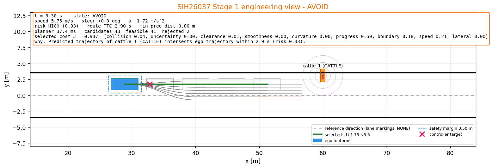
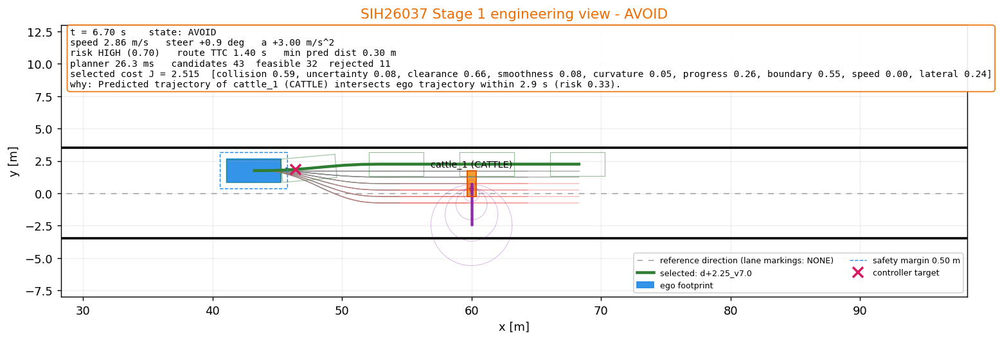
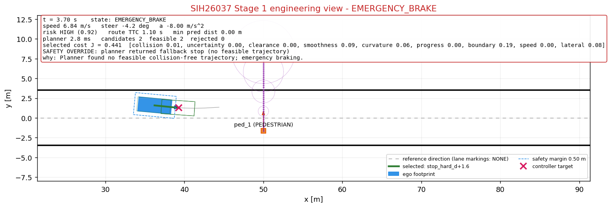
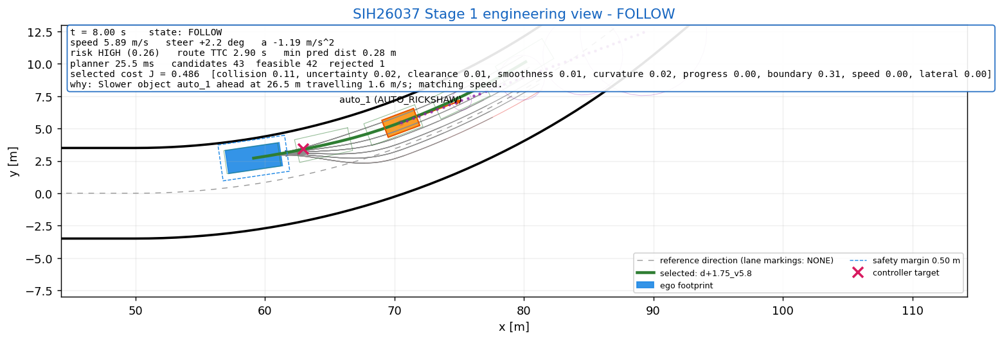
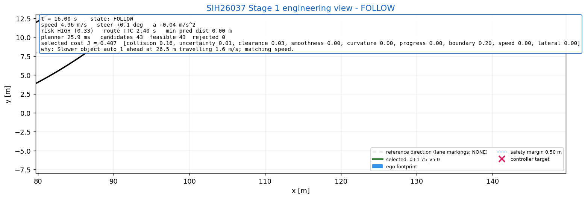

# Stage 1 Results — measured, not typed

Generated by `scripts/generate_results.py` on 2026-09-05 16:47 (Windows 10, Python 3.11.0rc2, numpy 2.4.2).

Every number below is produced by running the closed loop with the committed configuration (`config/*.yaml`). Re-run the script after any change; do not edit the numbers by hand.

## Automated tests

`python -m pytest tests` -> `101 passed in 50.99s`

## SUDDEN_CATTLE_CROSSING — PASS

Cattle near the left edge crosses an unmarked road into the ego path.

- Agent `cattle_1` (CATTLE, behaviour CROSSING): trigger_distance_m=30.0, crossing_speed_mps=0.8, acceleration_mps2=1.5, crossing_distance_m=6.0, stop_after=True

Ego desired speed 10.0 m/s, desired lateral offset 1.75 m, lane markings: NONE.

| Metric | Value |
|---|---|
| Scenario completed | True |
| Termination reason | GOAL_REACHED |
| Collisions | 0 |
| Minimum obstacle clearance [m] | 1.26 |
|   (configured safety margin = 0.5 m) |  |
| Minimum TTC (route view) [s] | 1.40 |
| Time to completion [s] | 15.20 |
| Path length [m] | 117.94 |
| Average speed [m/s] | 7.77 |
| Max acceleration [m/s^2] | 3.00 |
| Max deceleration [m/s^2] | 3.00 |
| Max steering rate [rad/s] | 0.785 |
| Max curvature (driven) [1/m] | 0.0405 |
| Mean |curvature| [1/m] | 0.0016 |
| Replanning cycles | 152 |
| Plan changes (offset or speed target) | 9 |
| Planner latency mean / max [ms] | 20.2 / 29.2 |
| Emergency-brake activations | 0 |
| Behaviour transitions | 4 |
| Behaviour state durations [s] | CRUISE 9.1, CAUTION 1.7, AVOID 4.4 |
| Max jerk [m/s^3] (hook) | 150.1 |
| Path smoothness, mean d(kappa)^2 (hook) | 0.00000079 |
| Prediction error @1 s [m] (hook) | 0.056 |
| Perception latency (hook) | n/a (no sensors in Stage 1) |

### Behaviour timeline (from the decision log)

| t [s] | state | machine-readable reason |
|---|---|---|
| 0.00 | CRUISE | No significant risk; cruising toward goal. |
| 2.00 | CAUTION | Route at desired speed intersects a predicted object in 3.8 s (beyond the avoidance horizon); reducing speed. cattle_1 (CATTLE): TTC 3.8 s, min predicted distance 0.00 m at +3.8 s, risk 0.21 [MEDIUM]. |
| 3.20 | AVOID | Predicted trajectory of cattle_1 (CATTLE) intersects ego trajectory within 2.9 s (risk 0.33). |
| 7.60 | CAUTION | Selected trajectory clear of predicted objects (max risk 0.22). |
| 8.10 | CRUISE | Risk cleared (max risk 0.10); resuming cruise. |

### Why was this trajectory selected? (planning cycle at t = 8.30 s, 25 feasible / 18 rejected, 18.4 ms)

| candidate | collision | uncertainty | clearance | smoothness | curvature | progress | boundary | speed | lateral | total |
|---|---|---|---|---|---|---|---|---|---|---|
| d+2.25_v10.0 **(selected)** | 0.14 | 0.00 | 0.71 | 0.05 | 0.01 | 0.12 | 0.50 | 0.00 | 0.24 | 1.776 |
| d+1.75_v10.0 | 0.61 | 0.02 | 1.03 | 0.07 | 0.03 | 0.12 | 0.40 | 0.00 | 0.00 | 2.281 |
| d+2.25_v8.0 | 0.14 | 0.01 | 0.69 | 0.02 | 0.01 | 0.52 | 0.50 | 0.30 | 0.24 | 2.430 |
| d+1.75_v8.0 | 0.58 | 0.02 | 1.01 | 0.05 | 0.03 | 0.52 | 0.40 | 0.30 | 0.00 | 2.913 |

Rejected before ranking (examples):

- `d-0.75_v10.0`: LATERAL_ACCELERATION_LIMIT — v^2*kappa=9.00 > 3.50 m/s^2 at +1.3s
- `d-0.75_v8.0`: LATERAL_ACCELERATION_LIMIT — v^2*kappa=5.87 > 3.50 m/s^2 at +1.4s
- `d-0.75_v6.0`: PREDICTED_COLLISION — distance 0.14 m <= margin 0.50 m to cattle_1 at +1.1s

### Engineering view snapshots

Telemetry: `logs/sudden_cattle_crossing.jsonl` (every step), `logs/sudden_cattle_crossing_summary.csv` (per planning cycle).

## SUDDEN_PEDESTRIAN_DART — PASS

Pedestrian darts from the right edge into the ego path at very short range.

- Agent `ped_1` (PEDESTRIAN, behaviour CROSSING): trigger_distance_m=22.0, crossing_speed_mps=2.5, acceleration_mps2=4.0, crossing_distance_m=7.5, stop_after=True

Ego desired speed 10.0 m/s, desired lateral offset 1.75 m, lane markings: NONE.

| Metric | Value |
|---|---|
| Scenario completed | True |
| Termination reason | GOAL_REACHED |
| Collisions | 0 |
| Minimum obstacle clearance [m] | 1.34 |
|   (configured safety margin = 0.5 m) |  |
| Minimum TTC (route view) [s] | 0.70 |
| Time to completion [s] | 11.06 |
| Path length [m] | 98.02 |
| Average speed [m/s] | 8.88 |
| Max acceleration [m/s^2] | 3.00 |
| Max deceleration [m/s^2] | 8.00 |
| Max steering rate [rad/s] | 0.785 |
| Max curvature (driven) [1/m] | 0.0651 |
| Mean |curvature| [1/m] | 0.0069 |
| Replanning cycles | 111 |
| Plan changes (offset or speed target) | 16 |
| Planner latency mean / max [ms] | 18.3 / 26.4 |
| Emergency-brake activations | 1 |
| Behaviour transitions | 7 |
| Behaviour state durations [s] | CRUISE 8.9, CAUTION 0.6, AVOID 1.2, EMERGENCY_BRAKE 0.4 |
| Max jerk [m/s^3] (hook) | 440.0 |
| Path smoothness, mean d(kappa)^2 (hook) | 0.00000541 |
| Prediction error @1 s [m] (hook) | 0.242 |
| Perception latency (hook) | n/a (no sensors in Stage 1) |

### Behaviour timeline (from the decision log)

| t [s] | state | machine-readable reason |
|---|---|---|
| 0.00 | CRUISE | No significant risk; cruising toward goal. |
| 3.20 | CAUTION | Elevated collision risk without a predicted intersection: ped_1 (PEDESTRIAN): TTC inf, min predicted distance 0.61 m at +2.0 s, risk 0.27 [MEDIUM]. |
| 3.30 | AVOID | Predicted trajectory of ped_1 (PEDESTRIAN) intersects ego trajectory within 1.6 s (risk 0.72). |
| 3.70 | EMERGENCY_BRAKE | Planner found no feasible collision-free trajectory; emergency braking. |
| 4.10 | CAUTION | Critical condition cleared (level HIGH); handing back to planner. |
| 4.20 | AVOID | Predicted trajectory of ped_1 (PEDESTRIAN) intersects ego trajectory within 0.9 s (risk 1.02). |
| 5.00 | CAUTION | Selected trajectory clear of predicted objects (max risk 0.24). |
| 5.40 | CRUISE | Risk cleared (max risk 0.01); resuming cruise. |

### Why was this trajectory selected? (planning cycle at t = 3.20 s, 1 feasible / 42 rejected, 12.9 ms)

| candidate | collision | uncertainty | clearance | smoothness | curvature | progress | boundary | speed | lateral | total |
|---|---|---|---|---|---|---|---|---|---|---|
| stop_hard_d+1.77 **(selected)** | 0.02 | 0.00 | 0.00 | 0.13 | 0.03 | 1.85 | 0.26 | 0.90 | 0.01 | 3.196 |

Rejected before ranking (examples):

- `d-0.75_v6.0`: PREDICTED_COLLISION — distance 0.33 m <= margin 0.50 m to ped_1 at +2.1s
- `d-0.75_v4.8`: PREDICTED_COLLISION — distance 0.05 m <= margin 0.50 m to ped_1 at +2.3s
- `d-0.75_v3.6`: PREDICTED_COLLISION — distance 0.48 m <= margin 0.50 m to ped_1 at +2.3s

### Engineering view snapshots

Telemetry: `logs/sudden_pedestrian_dart.jsonl` (every step), `logs/sudden_pedestrian_dart_summary.csv` (per planning cycle).

## MIXED_TRAFFIC_CURVE — PASS

Left-hand curve with a merging auto-rickshaw ahead and an erratic pedestrian beyond it.

- Agent `auto_1` (AUTO_RICKSHAW, behaviour MERGING): trigger_distance_m=32.0, follow_road=True, target_speed_mps=5.0, yaw_rate_rad_s=0.5, acceleration_mps2=1.5
- Agent `ped_1` (PEDESTRIAN, behaviour ERRATIC): heading_sigma_rad=0.45, speed_sigma_mps=0.3, change_interval_s=1.0, max_speed_mps=1.5

Ego desired speed 8.0 m/s, desired lateral offset 1.75 m, lane markings: NONE, curved corridor built from segments.

| Metric | Value |
|---|---|
| Scenario completed | True |
| Termination reason | GOAL_REACHED |
| Collisions | 0 |
| Minimum obstacle clearance [m] | 1.38 |
|   (configured safety margin = 0.5 m) |  |
| Minimum TTC (route view) [s] | 1.30 |
| Time to completion [s] | 24.46 |
| Path length [m] | 141.49 |
| Average speed [m/s] | 5.79 |
| Max acceleration [m/s^2] | 3.00 |
| Max deceleration [m/s^2] | 3.01 |
| Max steering rate [rad/s] | 0.785 |
| Max curvature (driven) [1/m] | 0.0403 |
| Mean |curvature| [1/m] | 0.0063 |
| Replanning cycles | 245 |
| Plan changes (offset or speed target) | 68 |
| Planner latency mean / max [ms] | 27.0 / 53.7 |
| Emergency-brake activations | 0 |
| Behaviour transitions | 6 |
| Behaviour state durations [s] | CRUISE 1.8, FOLLOW 18.8, AVOID 3.5, CAUTION 0.4 |
| Max jerk [m/s^3] (hook) | 300.1 |
| Path smoothness, mean d(kappa)^2 (hook) | 0.00000303 |
| Prediction error @1 s [m] (hook) | 0.176 |
| Perception latency (hook) | n/a (no sensors in Stage 1) |

### Behaviour timeline (from the decision log)

| t [s] | state | machine-readable reason |
|---|---|---|
| 0.00 | CRUISE | No significant risk; cruising toward goal. |
| 1.80 | FOLLOW | Slower object auto_1 ahead at 26.5 m travelling 1.6 m/s; matching speed. |
| 16.30 | AVOID | Predicted trajectory of ped_1 (PEDESTRIAN) intersects ego trajectory within 2.6 s (risk 0.44). |
| 19.10 | FOLLOW | Slower object ped_1 ahead at 10.2 m travelling 1.1 m/s; matching speed. |
| 19.40 | AVOID | Predicted trajectory of ped_1 (PEDESTRIAN) intersects ego trajectory within 1.3 s (risk 0.84). |
| 20.10 | CAUTION | Selected trajectory clear of predicted objects (max risk 0.24). |
| 20.50 | FOLLOW | Slower object auto_1 ahead at 11.9 m travelling 5.0 m/s; matching speed. |

### Why was this trajectory selected? (planning cycle at t = 18.10 s, 31 feasible / 12 rejected, 24.3 ms)

| candidate | collision | uncertainty | clearance | smoothness | curvature | progress | boundary | speed | lateral | total |
|---|---|---|---|---|---|---|---|---|---|---|
| d+1.75_v3.4 **(selected)** | 0.15 | 0.02 | 0.03 | 0.00 | 0.00 | 1.00 | 0.19 | 0.42 | 0.00 | 1.807 |
| d+1.25_v3.4 | 0.15 | 0.02 | 0.03 | 0.02 | 0.05 | 1.00 | 0.21 | 0.42 | 0.24 | 2.141 |
| d+1.75_v2.2 | 0.02 | 0.00 | 0.00 | 0.01 | 0.00 | 1.48 | 0.19 | 0.63 | 0.00 | 2.331 |
| d+0.75_v3.4 | 0.15 | 0.02 | 0.03 | 0.03 | 0.11 | 1.00 | 0.24 | 0.42 | 0.48 | 2.477 |

Rejected before ranking (examples):

- `d-0.75_v5.6`: LATERAL_ACCELERATION_LIMIT — v^2*kappa=4.29 > 3.50 m/s^2 at +1.6s
- `d-0.25_v5.6`: PREDICTED_COLLISION — distance 0.49 m <= margin 0.50 m to ped_1 at +3.8s
- `d+0.25_v5.6`: PREDICTED_COLLISION — distance 0.35 m <= margin 0.50 m to ped_1 at +3.2s

### Engineering view snapshots

Telemetry: `logs/mixed_traffic_curve.jsonl` (every step), `logs/mixed_traffic_curve_summary.csv` (per planning cycle).

## Parameter sweeps — scenario success rate

Each cell is a complete closed-loop run with the committed configuration; only the named agent parameters change. The success rate is the Stage 2 `scenario_success_rate` metric made concrete.

### SUDDEN_CATTLE_CROSSING

| crossing_speed_mps | trigger_distance_m | completed | collisions | min clearance [m] | min TTC [s] | EB | t_done [s] | planner [ms] |
|---|---|---|---|---|---|---|---|---|
| 0.6 | 25.0 | True | 0 | 1.04 | 0.90 | 0 | 17.6 | 18 |
| 0.6 | 35.0 | True | 0 | 1.08 | 1.20 | 0 | 15.8 | 17 |
| 1.0 | 25.0 | True | 0 | 1.31 | 1.30 | 0 | 15.2 | 18 |
| 1.0 | 35.0 | True | 0 | 1.50 | 2.20 | 0 | 13.8 | 18 |
| 1.4 | 25.0 | True | 0 | 1.48 | 1.60 | 0 | 14.4 | 18 |
| 1.4 | 35.0 | True | 0 | 1.91 | 2.80 | 0 | 12.9 | 18 |

Scenario success rate: 6/6 = 1.00

### SUDDEN_PEDESTRIAN_DART

| trigger_distance_m | completed | collisions | min clearance [m] | min TTC [s] | EB | t_done [s] | planner [ms] |
|---|---|---|---|---|---|---|---|
| 18.0 | True | 0 | 1.24 | 0.30 | 1 | 11.9 | 17 |
| 22.0 | True | 0 | 1.34 | 0.70 | 1 | 11.1 | 17 |
| 26.0 | True | 0 | 1.64 | 1.10 | 1 | 10.7 | 18 |

Scenario success rate: 3/3 = 1.00

## Negative result kept on record: pedestrian dart at 14 m

With the dart triggered at 14 m instead of 22 m the run ends with `COLLISION` (collisions = 1, min clearance = 0.00 m, emergency-brake activations = 1, override at t = 4.30 s). Braking distance from 10 m/s at 8 m/s^2 is 6.2 m, and the constant-velocity predictor cannot see the dart until the pedestrian has actually accelerated, so the outcome is physically determined, not a tuning problem. It is recorded here rather than hidden; Stage 2 prediction (intent / acceleration-aware) is the lever.

## Known limitations (Stage 1)

- Constant-velocity prediction lags accelerating agents (see the 14 m result above).
- Jerk is not constrained: the planner may switch between deceleration and acceleration candidates between cycles; `max_jerk` is reported as a Stage 2 hook.
- The reference direction is a polyline; candidate curvature assumes zero reference curvature per segment, adequate for the straight corridors used here.
- Ground-truth objects with zero covariance; Stage 2 fusion will supply real covariances through the same `ObjectState` contract.
- Planner latency (~40 ms mean in pure Python/numpy) is measured and logged, not real-time.
