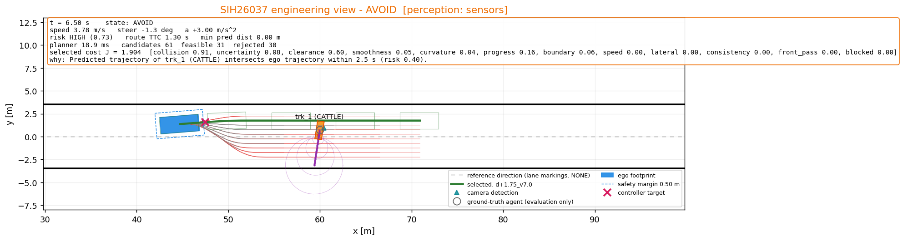

# Stage 1 Results — measured, not typed

Generated by `scripts/generate_results.py` on 2026-09-05 22:25 (Windows 10, Python 3.11.0rc2, numpy 2.4.2).

Every number below is produced by running the closed loop with the committed configuration (`config/*.yaml`). Re-run the script after any change; do not edit the numbers by hand.

## Scenario summary (sensors mode)

| Scenario | Result | Collisions | Min clearance [m] | Min TTC [s] | EB | Time [s] | Planner mean [ms] |
|---|---|---|---|---|---|---|---|
| UNMARKED_VILLAGE_ROAD | PASS | 0 | 1.02 | 2.20 | 0 | 35.7 | 20.1 |
| UNSIGNALIZED_INTERSECTION | PASS | 0 | 1.43 | 0.80 | 0 | 17.9 | 30.5 |
| HIGHWAY_MERGE_SLOW_VEHICLES | PASS | 0 | 1.26 | 2.40 | 0 | 27.6 | 33.4 |
| DENSE_MARKET_MIXED_TRAFFIC | PASS | 0 | 0.56 | 0.00 | 8 | 49.1 | 44.6 |
| SUDDEN_CATTLE_CROSSING | PASS | 0 | 1.03 | 1.00 | 0 | 15.0 | 21.8 |
| SUDDEN_PEDESTRIAN_DART | PASS | 0 | 1.11 | 0.20 | 2 | 14.3 | 19.9 |
| MIXED_TRAFFIC_CURVE | PASS | 0 | 2.26 | 1.70 | 0 | 26.2 | 25.3 |

## Automated tests

`python -m pytest tests` -> `137 passed in 152.34s (0:02:32)`

## UNMARKED_VILLAGE_ROAD — PASS (sensors mode)

Narrow unmarked village road with a parked pushcart, slow bicycle, walking pedestrian and a wandering cow.

- Agent `cart_1` (PUSHCART, behaviour STATIC): no parameters
- Agent `bike_1` (BICYCLE, behaviour CONSTANT_VELOCITY): no parameters
- Agent `ped_1` (PEDESTRIAN, behaviour CONSTANT_VELOCITY): no parameters
- Agent `cattle_1` (CATTLE, behaviour ERRATIC): heading_sigma_rad=0.6, speed_sigma_mps=0.4, change_interval_s=1.2, max_speed_mps=1.2

Ego desired speed 7.0 m/s, desired lateral offset 1.2 m, lane markings: NONE.

| Metric | Value |
|---|---|
| Scenario completed | True |
| Termination reason | GOAL_REACHED |
| Collisions | 0 |
| Minimum obstacle clearance [m] | 1.02 |
|   (configured safety margin = 0.5 m) |  |
| Minimum TTC (route view) [s] | 2.20 |
| Time to completion [s] | 35.70 |
| Path length [m] | 143.12 |
| Average speed [m/s] | 4.01 |
| Max acceleration [m/s^2] | 3.00 |
| Max deceleration [m/s^2] | 8.00 |
| Max steering rate [rad/s] | 0.785 |
| Max curvature (driven) [1/m] | 0.0932 |
| Mean |curvature| [1/m] | 0.0093 |
| Replanning cycles | 357 |
| Plan changes (offset or speed target) | 90 |
| Planner latency mean / max [ms] | 20.1 / 44.9 |
| Emergency-brake activations | 0 |
| Behaviour transitions | 16 |
| Behaviour state durations [s] | CRUISE 1.5, FOLLOW 31.7, CAUTION 2.1, AVOID 0.4 |
| Max jerk [m/s^3] (hook) | 549.9 |
| Path smoothness, mean d(kappa)^2 (hook) | 0.00000771 |
| Prediction error @1 s [m] (hook) | 0.353 |
| Perception latency (hook) | n/a (no sensors in Stage 1) |

Ground-truth mode for comparison: GOAL_REACHED, collisions 0, min clearance 0.83 m, min TTC 2.40 s, EB 0, done 35.7 s, planner 20.8 ms.

Perception (sensors mode): tracking position error 0.169 m, velocity error 0.219 m/s, perception latency 58.8 ms, detections 3405, mean published tracks 3.59.

### Behaviour timeline (from the decision log)

| t [s] | state | machine-readable reason |
|---|---|---|
| 0.00 | CRUISE | No significant risk; cruising toward goal. |
| 0.10 | FOLLOW | Slower object trk_2 ahead at 26.4 m travelling 3.6 m/s; matching speed. |
| 2.50 | CAUTION | Route at desired speed intersects a predicted object in 3.4 s (beyond the avoidance horizon); reducing speed. trk_1 (PUSHCART): TTC 3.4 s, min predicted distance 0.21 m at +4.0 s, risk 0.22 [MEDIUM]. |
| 2.90 | FOLLOW | Slower object trk_2 ahead at 20.8 m travelling 3.4 m/s; matching speed. |
| 4.00 | AVOID | Predicted trajectory of trk_1 (PUSHCART) intersects ego trajectory within 2.4 s (risk 0.36). |
| 4.40 | CAUTION | Selected trajectory clear of predicted objects (max risk 0.05). |
| 4.80 | FOLLOW | Slower object trk_2 ahead at 20.3 m travelling 3.4 m/s; matching speed. |
| 5.70 | CRUISE | Lead object gone and no elevated risk; resuming cruise. |
| 5.80 | FOLLOW | Slower object trk_2 ahead at 18.6 m travelling 3.6 m/s; matching speed. |
| 6.20 | CRUISE | Lead object gone and no elevated risk; resuming cruise. |
| 7.50 | FOLLOW | Slower object trk_2 ahead at 14.6 m travelling 3.7 m/s; matching speed. |
| 8.20 | CAUTION | Elevated collision risk without a predicted intersection: trk_1 (PUSHCART): TTC inf, min predicted distance 0.69 m at +0.1 s, risk 0.32 [MEDIUM]. |
| 8.70 | FOLLOW | Slower object trk_2 ahead at 13.2 m travelling 3.6 m/s; matching speed. |
| 13.20 | CAUTION | Elevated collision risk without a predicted intersection: trk_2 (BICYCLE): TTC 3.0 s, min predicted distance 0.00 m at +3.2 s, risk 0.31 [MEDIUM]. |
| 13.60 | FOLLOW | Slower object trk_2 ahead at 10.5 m travelling 3.7 m/s; matching speed. |
| 15.30 | CAUTION | Elevated collision risk without a predicted intersection: trk_2 (BICYCLE): TTC 2.5 s, min predicted distance 0.00 m at +2.7 s, risk 0.40 [HIGH]. |
| 15.70 | FOLLOW | Slower object trk_2 ahead at 9.6 m travelling 3.6 m/s; matching speed. |

### Why was this trajectory selected? (planning cycle at t = 15.30 s, 3 feasible / 22 rejected, 13.1 ms)

| candidate | collision | uncertainty | clearance | smoothness | curvature | progress | boundary | speed | lateral | consistency | front_pass | blocked | total |
|---|---|---|---|---|---|---|---|---|---|---|---|---|---|
| d+0.70_v3.4 **(selected)** | 1.65 | 0.12 | 0.94 | 0.01 | 0.00 | 0.49 | 0.08 | 0.18 | 0.25 | 0.00 | 1.50 | 0.00 | 5.221 |
| d+0.70_v4.2 | 1.62 | 0.09 | 0.86 | 0.00 | 0.00 | 0.00 | 0.08 | 0.00 | 0.25 | 0.00 | 1.50 | 0.88 | 5.291 |
| d+0.70_v2.5 | 1.65 | 0.18 | 1.07 | 0.02 | 0.00 | 0.96 | 0.08 | 0.36 | 0.25 | 0.00 | 1.50 | 0.00 | 6.063 |

Rejected before ranking (examples):

- `d-0.80_v4.2`: PREDICTED_COLLISION — distance 0.14 m <= margin 0.63 m to trk_3 at +0.7s
- `d-0.80_v3.4`: PREDICTED_COLLISION — distance 0.20 m <= margin 0.63 m to trk_3 at +0.8s
- `d-0.80_v2.5`: PREDICTED_COLLISION — distance 0.59 m <= margin 0.63 m to trk_3 at +0.8s

### Engineering view snapshots

Telemetry: `logs/unmarked_village_road.jsonl` (every step), `logs/unmarked_village_road_summary.csv` (per planning cycle).

## UNSIGNALIZED_INTERSECTION — PASS (sensors mode)

Unmarked crossroads without signals; cars, an auto-rickshaw and a motorcycle cross the ego corridor from both sides.

- Agent `car_south` (CAR, behaviour CONSTANT_VELOCITY): no parameters
- Agent `auto_north` (AUTO_RICKSHAW, behaviour CROSSING): trigger_distance_m=45.0, crossing_speed_mps=4.0, acceleration_mps2=2.0, crossing_distance_m=30.0, stop_after=True
- Agent `moto_south` (MOTORCYCLE, behaviour CONSTANT_VELOCITY): no parameters
- Agent `ped_corner` (PEDESTRIAN, behaviour CROSSING): trigger_distance_m=20.0, crossing_speed_mps=1.3, crossing_distance_m=7.0, stop_after=True

Ego desired speed 8.0 m/s, desired lateral offset 1.75 m, lane markings: NONE.

| Metric | Value |
|---|---|
| Scenario completed | True |
| Termination reason | GOAL_REACHED |
| Collisions | 0 |
| Minimum obstacle clearance [m] | 1.43 |
|   (configured safety margin = 0.5 m) |  |
| Minimum TTC (route view) [s] | 0.80 |
| Time to completion [s] | 17.86 |
| Path length [m] | 127.99 |
| Average speed [m/s] | 7.18 |
| Max acceleration [m/s^2] | 3.00 |
| Max deceleration [m/s^2] | 3.07 |
| Max steering rate [rad/s] | 0.785 |
| Max curvature (driven) [1/m] | 0.1067 |
| Mean |curvature| [1/m] | 0.0117 |
| Replanning cycles | 179 |
| Plan changes (offset or speed target) | 57 |
| Planner latency mean / max [ms] | 30.5 / 83.1 |
| Emergency-brake activations | 0 |
| Behaviour transitions | 3 |
| Behaviour state durations [s] | CRUISE 14.1, AVOID 3.4, CAUTION 0.4 |
| Max jerk [m/s^3] (hook) | 300.0 |
| Path smoothness, mean d(kappa)^2 (hook) | 0.00001161 |
| Prediction error @1 s [m] (hook) | 0.456 |
| Perception latency (hook) | n/a (no sensors in Stage 1) |

Ground-truth mode for comparison: GOAL_REACHED, collisions 0, min clearance 1.44 m, min TTC 1.00 s, EB 0, done 18.1 s, planner 30.9 ms.

Perception (sensors mode): tracking position error 0.188 m, velocity error 0.309 m/s, perception latency 59.4 ms, detections 1584, mean published tracks 3.58.

### Behaviour timeline (from the decision log)

| t [s] | state | machine-readable reason |
|---|---|---|
| 0.00 | CRUISE | No significant risk; cruising toward goal. |
| 6.60 | AVOID | Predicted trajectory of trk_13 (PEDESTRIAN) intersects ego trajectory within 2.3 s (risk 0.51). |
| 10.00 | CAUTION | Selected trajectory clear of predicted objects (max risk 0.20). |
| 10.40 | CRUISE | Lead object gone and no elevated risk; resuming cruise. |

### Why was this trajectory selected? (planning cycle at t = 7.90 s, 20 feasible / 41 rejected, 36.0 ms)

| candidate | collision | uncertainty | clearance | smoothness | curvature | progress | boundary | speed | lateral | consistency | front_pass | blocked | total |
|---|---|---|---|---|---|---|---|---|---|---|---|---|---|
| d+1.75_v2.2 **(selected)** | 0.39 | 0.07 | 0.40 | 0.07 | 0.16 | 1.39 | 0.07 | 0.63 | 0.00 | 0.00 | 0.00 | 0.00 | 3.185 |
| d+1.75_v1.1 | 0.18 | 0.02 | 0.09 | 0.07 | 0.16 | 1.76 | 0.07 | 0.84 | 0.00 | 0.00 | 0.00 | 0.00 | 3.201 |
| d+1.25_v1.1 | 0.19 | 0.02 | 0.09 | 0.06 | 0.14 | 1.76 | 0.02 | 0.84 | 0.25 | 0.07 | 0.00 | 0.00 | 3.443 |
| d+1.75_v0.0 | 0.06 | 0.01 | 0.09 | 0.08 | 0.16 | 2.09 | 0.02 | 1.05 | 0.00 | 0.00 | 0.00 | 0.00 | 3.559 |

Rejected before ranking (examples):

- `d-2.25_v5.6`: LATERAL_ACCELERATION_LIMIT — v^2*kappa=5.57 > 3.50 m/s^2 at +1.4s
- `d-2.25_v4.5`: LATERAL_ACCELERATION_LIMIT — v^2*kappa=3.56 > 3.50 m/s^2 at +1.7s
- `d-2.25_v3.4`: OUTSIDE_DRIVABLE_SPACE — boundary clearance 0.19 m < margin 0.25 m at +1.8s

### Engineering view snapshots

Telemetry: `logs/unsignalized_intersection.jsonl` (every step), `logs/unsignalized_intersection_summary.csv` (per planning cycle).

## HIGHWAY_MERGE_SLOW_VEHICLES — PASS (sensors mode)

Two-way unmarked highway; slow truck ahead, auto-rickshaw merging from the shoulder, bus in the oncoming half, car merging later.

- Agent `truck_1` (TRUCK, behaviour CONSTANT_VELOCITY): no parameters
- Agent `auto_shoulder` (AUTO_RICKSHAW, behaviour MERGING): trigger_distance_m=60.0, yield_gap_m=25.0, follow_road=True, target_speed_mps=6.0, yaw_rate_rad_s=0.4, acceleration_mps2=1.2
- Agent `bus_onc` (BUS, behaviour CONSTANT_VELOCITY): no parameters
- Agent `car_shoulder` (CAR, behaviour MERGING): trigger_distance_m=70.0, follow_road=True, target_speed_mps=9.0, yaw_rate_rad_s=0.4, acceleration_mps2=1.5

Ego desired speed 20.0 m/s, desired lateral offset 2.5 m, lane markings: NONE.

| Metric | Value |
|---|---|
| Scenario completed | True |
| Termination reason | GOAL_REACHED |
| Collisions | 0 |
| Minimum obstacle clearance [m] | 1.26 |
|   (configured safety margin = 0.5 m) |  |
| Minimum TTC (route view) [s] | 2.40 |
| Time to completion [s] | 27.64 |
| Path length [m] | 327.82 |
| Average speed [m/s] | 11.87 |
| Max acceleration [m/s^2] | 3.00 |
| Max deceleration [m/s^2] | 8.00 |
| Max steering rate [rad/s] | 0.785 |
| Max curvature (driven) [1/m] | 0.0382 |
| Mean |curvature| [1/m] | 0.0031 |
| Replanning cycles | 277 |
| Plan changes (offset or speed target) | 75 |
| Planner latency mean / max [ms] | 33.4 / 78.0 |
| Emergency-brake activations | 0 |
| Behaviour transitions | 15 |
| Behaviour state durations [s] | CRUISE 23.9, CAUTION 2.6, AVOID 1.1 |
| Max jerk [m/s^3] (hook) | 550.0 |
| Path smoothness, mean d(kappa)^2 (hook) | 0.00000347 |
| Prediction error @1 s [m] (hook) | 0.612 |
| Perception latency (hook) | n/a (no sensors in Stage 1) |

Ground-truth mode for comparison: GOAL_REACHED, collisions 0, min clearance 1.36 m, min TTC inf s, EB 0, done 28.2 s, planner 37.4 ms.

Perception (sensors mode): tracking position error 0.532 m, velocity error 0.332 m/s, perception latency 57.9 ms, detections 2251, mean published tracks 2.61.

### Behaviour timeline (from the decision log)

| t [s] | state | machine-readable reason |
|---|---|---|
| 0.00 | CRUISE | No significant risk; cruising toward goal. |
| 5.60 | CAUTION | Route at desired speed intersects a predicted object in 3.0 s (beyond the avoidance horizon); reducing speed. trk_6 (UNKNOWN): TTC 3.0 s, min predicted distance 0.83 m at +3.0 s, risk 0.27 [MEDIUM]. |
| 5.80 | AVOID | Predicted trajectory of trk_6 (UNKNOWN) intersects ego trajectory within 2.8 s (risk 0.30). |
| 6.50 | CAUTION | Selected trajectory clear of predicted objects (max risk 0.13). |
| 6.90 | CRUISE | Lead object gone and no elevated risk; resuming cruise. |
| 7.90 | AVOID | Predicted trajectory of trk_15 (AUTO_RICKSHAW) intersects ego trajectory within 2.9 s (risk 0.26). |
| 8.30 | CAUTION | Selected trajectory clear of predicted objects (max risk 0.11). |
| 8.70 | CRUISE | Lead object gone and no elevated risk; resuming cruise. |
| 12.20 | CAUTION | Elevated collision risk without a predicted intersection: trk_15 (AUTO_RICKSHAW): TTC inf, min predicted distance 0.74 m at +1.8 s, risk 0.23 [MEDIUM]. |
| 12.60 | CRUISE | Lead object gone and no elevated risk; resuming cruise. |
| 13.40 | CAUTION | Elevated collision risk without a predicted intersection: trk_15 (AUTO_RICKSHAW): TTC inf, min predicted distance 0.74 m at +1.6 s, risk 0.24 [MEDIUM]. |
| 13.80 | CRUISE | Lead object gone and no elevated risk; resuming cruise. |
| 14.00 | CAUTION | Elevated collision risk without a predicted intersection: trk_15 (AUTO_RICKSHAW): TTC inf, min predicted distance 0.78 m at +1.5 s, risk 0.23 [MEDIUM]. |
| 14.40 | CRUISE | Lead object gone and no elevated risk; resuming cruise. |
| 15.70 | CAUTION | Elevated collision risk without a predicted intersection: trk_15 (AUTO_RICKSHAW): TTC inf, min predicted distance 0.75 m at +1.1 s, risk 0.25 [MEDIUM]. |
| 16.10 | CRUISE | Lead object gone and no elevated risk; resuming cruise. |

### Why was this trajectory selected? (planning cycle at t = 6.30 s, 1 feasible / 91 rejected, 40.2 ms)

| candidate |  | total |
|---|---|

Rejected before ranking (examples):

- `d-3.50_v14.0`: LATERAL_ACCELERATION_LIMIT — v^2*kappa=13.83 > 3.50 m/s^2 at +1.4s
- `d-3.50_v11.2`: LATERAL_ACCELERATION_LIMIT — v^2*kappa=9.01 > 3.50 m/s^2 at +0.4s
- `d-3.50_v8.4`: LATERAL_ACCELERATION_LIMIT — v^2*kappa=6.75 > 3.50 m/s^2 at +0.4s

### Engineering view snapshots

Telemetry: `logs/highway_merge_slow_vehicles.jsonl` (every step), `logs/highway_merge_slow_vehicles_summary.csv` (per planning cycle).

## DENSE_MARKET_MIXED_TRAFFIC — PASS (sensors mode)

Market street with parked carts, a slow auto-rickshaw, a filtering motorcycle, crossing and walking pedestrians and a standing cow.

- Agent `cart_left` (PUSHCART, behaviour STATIC): no parameters
- Agent `cart_right` (PUSHCART, behaviour STATIC): no parameters
- Agent `cart_left2` (PUSHCART, behaviour STATIC): no parameters
- Agent `auto_slow` (AUTO_RICKSHAW, behaviour CONSTANT_VELOCITY): no parameters
- Agent `moto_onc` (MOTORCYCLE, behaviour CONSTANT_VELOCITY): no parameters
- Agent `ped_cross_a` (PEDESTRIAN, behaviour CROSSING): trigger_distance_m=18.0, crossing_speed_mps=1.2, crossing_distance_m=6.0, stop_after=True
- Agent `ped_cross_b` (PEDESTRIAN, behaviour CROSSING): trigger_distance_m=22.0, crossing_speed_mps=1.0, crossing_distance_m=6.0, stop_after=True
- Agent `ped_walk` (PEDESTRIAN, behaviour CONSTANT_VELOCITY): no parameters
- Agent `cattle_edge` (CATTLE, behaviour STATIC): no parameters

Ego desired speed 5.0 m/s, desired lateral offset 1.4 m, lane markings: NONE.

| Metric | Value |
|---|---|
| Scenario completed | True |
| Termination reason | GOAL_REACHED |
| Collisions | 0 |
| Minimum obstacle clearance [m] | 0.56 |
|   (configured safety margin = 0.5 m) |  |
| Minimum TTC (route view) [s] | 0.00 |
| Time to completion [s] | 49.06 |
| Path length [m] | 118.50 |
| Average speed [m/s] | 2.42 |
| Max acceleration [m/s^2] | 3.00 |
| Max deceleration [m/s^2] | 8.00 |
| Max steering rate [rad/s] | 0.785 |
| Max curvature (driven) [1/m] | 0.1772 |
| Mean |curvature| [1/m] | 0.0295 |
| Replanning cycles | 491 |
| Plan changes (offset or speed target) | 243 |
| Planner latency mean / max [ms] | 44.6 / 87.4 |
| Emergency-brake activations | 8 |
| Behaviour transitions | 70 |
| Behaviour state durations [s] | CRUISE 13.0, FOLLOW 4.2, CAUTION 8.8, AVOID 13.9, EMERGENCY_BRAKE 2.0, STOPPED 7.2 |
| Max jerk [m/s^3] (hook) | 550.0 |
| Path smoothness, mean d(kappa)^2 (hook) | 0.00002588 |
| Prediction error @1 s [m] (hook) | 0.715 |
| Perception latency (hook) | n/a (no sensors in Stage 1) |

Ground-truth mode for comparison: GOAL_REACHED, collisions 0, min clearance 0.65 m, min TTC 0.90 s, EB 1, done 36.1 s, planner 49.5 ms.

Perception (sensors mode): tracking position error 0.277 m, velocity error 0.305 m/s, perception latency 55.1 ms, detections 10110, mean published tracks 8.33.

### Behaviour timeline (from the decision log)

| t [s] | state | machine-readable reason |
|---|---|---|
| 0.00 | CRUISE | No significant risk; cruising toward goal. |
| 0.10 | FOLLOW | Slower object trk_4 ahead at 21.1 m travelling 2.9 m/s; matching speed. |
| 2.00 | CAUTION | Route at desired speed intersects a predicted object in 3.5 s (beyond the avoidance horizon); reducing speed. trk_1 (PUSHCART): TTC 3.5 s, min predicted distance 0.48 m at +3.5 s, risk 0.21 [MEDIUM]. |
| 2.80 | FOLLOW | Slower object trk_23 ahead at 18.4 m travelling 3.0 m/s; matching speed. |
| 2.90 | CAUTION | Route at desired speed intersects a predicted object in 3.1 s (beyond the avoidance horizon); reducing speed. trk_1 (PUSHCART): TTC 3.1 s, min predicted distance 0.31 m at +3.5 s, risk 0.25 [MEDIUM]. |
| 3.10 | AVOID | Predicted trajectory of trk_1 (PUSHCART) intersects ego trajectory within 2.9 s (risk 0.28). |
| 3.70 | CAUTION | Selected trajectory clear of predicted objects (max risk 0.11). |
| 4.00 | AVOID | Predicted trajectory of trk_1 (PUSHCART) intersects ego trajectory within 2.5 s (risk 0.34). |
| 4.40 | CAUTION | Selected trajectory clear of predicted objects (max risk 0.13). |
| 4.50 | AVOID | Predicted trajectory of trk_1 (PUSHCART) intersects ego trajectory within 2.1 s (risk 0.42). |
| 4.90 | CAUTION | Selected trajectory clear of predicted objects (max risk 0.08). |
| 5.30 | FOLLOW | Slower object trk_23 ahead at 18.7 m travelling 2.9 m/s; matching speed. |
| 7.30 | CAUTION | Route at desired speed intersects a predicted object in 3.8 s (beyond the avoidance horizon); reducing speed. trk_3 (MOTORCYCLE): TTC 3.8 s, min predicted distance 0.35 m at +3.8 s, risk 0.21 [MEDIUM]. |
| 8.00 | AVOID | Predicted trajectory of trk_1 (PUSHCART) intersects ego trajectory within 1.2 s (risk 0.66). |
| 8.50 | FOLLOW | Slower object trk_23 ahead at 25.1 m travelling 3.0 m/s; matching speed. |
| 8.70 | AVOID | Predicted trajectory of trk_55 (MOTORCYCLE) intersects ego trajectory within 2.9 s (risk 0.33). |
| 11.50 | EMERGENCY_BRAKE | Physical TTC 1.00 s at current speed 3.4 m/s with trk_1; emergency braking. |
| 11.90 | STOPPED | Vehicle brought to a halt; holding while the planner looks for a clear path. trk_55 (MOTORCYCLE): TTC 0.9 s, min predicted distance 0.52 m at +1.4 s, risk 0.89 [HIGH]. |
| 12.50 | AVOID | Planner found a clear trajectory around trk_55; moving off under avoidance. |
| 13.10 | STOPPED | Stationary for 1.1 s while avoiding trk_55; searching for a clear path. |
| 14.70 | CAUTION | Residual risk without an imminent threat; proceeding with caution. |
| 14.80 | EMERGENCY_BRAKE | Physical TTC 0.30 s at current speed 0.8 m/s with trk_77; emergency braking. |
| 15.20 | STOPPED | Vehicle brought to a halt; holding while the planner looks for a clear path. trk_77 (UNKNOWN): TTC 0.7 s, min predicted distance 0.55 m at +0.8 s, risk 0.85 [CRITICAL]. |
| 15.60 | CAUTION | Residual risk without an imminent threat; proceeding with caution. |
| 16.00 | AVOID | Selected trajectory intersects trk_77 within 1.0 s (plan risk 0.73); re-planning under avoidance. |
| 16.40 | EMERGENCY_BRAKE | Physical TTC 0.30 s at current speed 1.7 m/s with trk_89; emergency braking. |
| 16.80 | STOPPED | Vehicle brought to a halt; holding while the planner looks for a clear path. trk_89 (UNKNOWN): TTC inf, min predicted distance 0.65 m at +0.0 s, risk 0.49 [HIGH]. |
| 17.20 | CAUTION | Residual risk without an imminent threat; proceeding with caution. |
| 17.30 | AVOID | Selected trajectory intersects trk_89 within 0.5 s (plan risk 0.93); re-planning under avoidance. |
| 17.50 | EMERGENCY_BRAKE | Physical TTC 0.40 s at current speed 1.4 m/s with trk_89; emergency braking. |
| 17.90 | STOPPED | Vehicle brought to a halt; holding while the planner looks for a clear path. trk_89 (UNKNOWN): TTC inf, min predicted distance 0.68 m at +0.3 s, risk 0.38 [MEDIUM]. |
| 18.30 | CAUTION | Residual risk without an imminent threat; proceeding with caution. |
| 18.60 | AVOID | Selected trajectory intersects trk_89 within 0.9 s (plan risk 0.77); re-planning under avoidance. |
| 19.10 | STOPPED | Stationary for 1.1 s while avoiding trk_89; searching for a clear path. |
| 19.70 | CAUTION | Residual risk without an imminent threat; proceeding with caution. |
| 19.80 | STOPPED | Stationary for 1.8 s while avoiding trk_2; searching for a clear path. |
| 20.20 | CAUTION | Residual risk without an imminent threat; proceeding with caution. |
| 21.10 | EMERGENCY_BRAKE | Physical TTC 0.30 s at current speed 2.8 m/s with trk_105; emergency braking. |
| 21.50 | STOPPED | Vehicle brought to a halt; holding while the planner looks for a clear path. trk_105 (UNKNOWN): TTC inf, min predicted distance 0.61 m at +0.0 s, risk 0.53 [HIGH]. |
| 22.30 | CAUTION | Residual risk without an imminent threat; proceeding with caution. |
| 22.40 | AVOID | Selected trajectory intersects trk_105 within 0.5 s (plan risk 0.93); re-planning under avoidance. |
| 22.70 | STOPPED | Stationary for 1.1 s while avoiding trk_105; searching for a clear path. |
| 23.20 | CAUTION | Risk cleared while stopped (max risk 0.00); resuming. |
| 23.30 | STOPPED | Stationary for 1.7 s while avoiding trk_114; searching for a clear path. |
| 24.00 | CAUTION | Residual risk without an imminent threat; proceeding with caution. |
| 24.10 | STOPPED | Stationary for 2.5 s while avoiding trk_116; searching for a clear path. |
| 24.50 | CAUTION | Risk cleared while stopped (max risk 0.00); resuming. |
| 24.60 | STOPPED | Stationary for 3.0 s while avoiding trk_120; searching for a clear path. |
| 25.00 | CAUTION | Residual risk without an imminent threat; proceeding with caution. |
| 25.10 | AVOID | Selected trajectory intersects trk_122 within 1.1 s (plan risk 1.20); re-planning under avoidance. |
| 25.50 | CAUTION | Selected trajectory clear of predicted objects (max risk 0.01). |
| 26.50 | CRUISE | Lead object gone and no elevated risk; resuming cruise. |
| 29.20 | AVOID | Predicted trajectory of trk_120 (PEDESTRIAN) intersects ego trajectory within 2.1 s (risk 0.56). |
| 32.90 | CAUTION | Selected trajectory clear of predicted objects (max risk 0.24). |
| 33.20 | CRUISE | Lead object gone and no elevated risk; resuming cruise. |
| 34.40 | CAUTION | Route at desired speed intersects a predicted object in 3.2 s (beyond the avoidance horizon); reducing speed. trk_101 (PEDESTRIAN): TTC 3.2 s, min predicted distance 0.00 m at +3.7 s, risk 0.32 [MEDIUM]. |
| 34.60 | AVOID | Predicted trajectory of trk_101 (PEDESTRIAN) intersects ego trajectory within 2.9 s (risk 0.38). |
| 36.80 | CAUTION | Selected trajectory clear of predicted objects (max risk 0.23). |
| 37.20 | CRUISE | Lead object gone and no elevated risk; resuming cruise. |
| 38.70 | CAUTION | Route at desired speed intersects a predicted object in 3.5 s (beyond the avoidance horizon); reducing speed. trk_44 (PUSHCART): TTC 3.5 s, min predicted distance 0.06 m at +4.0 s, risk 0.21 [MEDIUM]. |
| 39.50 | CRUISE | Lead object gone and no elevated risk; resuming cruise. |
| 39.60 | CAUTION | Route at desired speed intersects a predicted object in 3.2 s (beyond the avoidance horizon); reducing speed. trk_44 (PUSHCART): TTC 3.2 s, min predicted distance 0.40 m at +3.3 s, risk 0.24 [MEDIUM]. |
| 40.00 | AVOID | Predicted trajectory of trk_44 (PUSHCART) intersects ego trajectory within 2.9 s (risk 0.28). |
| 40.30 | CAUTION | Selected trajectory clear of predicted objects (max risk 0.12). |
| 40.60 | CRUISE | Lead object gone and no elevated risk; resuming cruise. |
| 40.80 | CAUTION | Route at desired speed intersects a predicted object in 3.1 s (beyond the avoidance horizon); reducing speed. trk_44 (PUSHCART): TTC 3.1 s, min predicted distance 0.54 m at +3.6 s, risk 0.25 [MEDIUM]. |
| 40.90 | AVOID | Predicted trajectory of trk_44 (PUSHCART) intersects ego trajectory within 2.6 s (risk 0.33). |
| 41.20 | CAUTION | Selected trajectory clear of predicted objects (max risk 0.10). |
| 41.30 | AVOID | Predicted trajectory of trk_44 (PUSHCART) intersects ego trajectory within 2.2 s (risk 0.40). |
| 41.60 | CAUTION | Selected trajectory clear of predicted objects (max risk 0.01). |
| 41.90 | CRUISE | Lead object gone and no elevated risk; resuming cruise. |

### Why was this trajectory selected? (planning cycle at t = 11.90 s, 1 feasible / 49 rejected, 53.2 ms)

| candidate |  | total |
|---|---|

Rejected before ranking (examples):

- `d-1.60_v3.0`: PREDICTED_COLLISION — distance 0.00 m <= margin 0.56 m to trk_55 at +1.2s
- `d-1.60_v2.4`: PREDICTED_COLLISION — distance 0.19 m <= margin 0.56 m to trk_55 at +1.2s
- `d-1.60_v1.8`: PREDICTED_COLLISION — distance 0.54 m <= margin 0.56 m to trk_55 at +1.2s

### Engineering view snapshots

Telemetry: `logs/dense_market_mixed_traffic.jsonl` (every step), `logs/dense_market_mixed_traffic_summary.csv` (per planning cycle).

## SUDDEN_CATTLE_CROSSING — PASS (sensors mode)

Cattle near the left edge crosses an unmarked road into the ego path.

- Agent `cattle_1` (CATTLE, behaviour CROSSING): trigger_distance_m=30.0, crossing_speed_mps=0.8, acceleration_mps2=1.5, crossing_distance_m=6.0, stop_after=True

Ego desired speed 10.0 m/s, desired lateral offset 1.75 m, lane markings: NONE.

| Metric | Value |
|---|---|
| Scenario completed | True |
| Termination reason | GOAL_REACHED |
| Collisions | 0 |
| Minimum obstacle clearance [m] | 1.03 |
|   (configured safety margin = 0.5 m) |  |
| Minimum TTC (route view) [s] | 1.00 |
| Time to completion [s] | 14.96 |
| Path length [m] | 118.14 |
| Average speed [m/s] | 7.91 |
| Max acceleration [m/s^2] | 3.00 |
| Max deceleration [m/s^2] | 3.17 |
| Max steering rate [rad/s] | 0.785 |
| Max curvature (driven) [1/m] | 0.1008 |
| Mean |curvature| [1/m] | 0.0097 |
| Replanning cycles | 150 |
| Plan changes (offset or speed target) | 40 |
| Planner latency mean / max [ms] | 21.8 / 41.3 |
| Emergency-brake activations | 0 |
| Behaviour transitions | 9 |
| Behaviour state durations [s] | CRUISE 9.0, CAUTION 1.4, AVOID 4.6 |
| Max jerk [m/s^3] (hook) | 300.0 |
| Path smoothness, mean d(kappa)^2 (hook) | 0.00000839 |
| Prediction error @1 s [m] (hook) | 0.279 |
| Perception latency (hook) | n/a (no sensors in Stage 1) |

Ground-truth mode for comparison: GOAL_REACHED, collisions 0, min clearance 0.82 m, min TTC 0.50 s, EB 0, done 14.8 s, planner 20.4 ms.

Perception (sensors mode): tracking position error 0.073 m, velocity error 0.204 m/s, perception latency 60.5 ms, detections 416, mean published tracks 0.97.

### Behaviour timeline (from the decision log)

| t [s] | state | machine-readable reason |
|---|---|---|
| 0.00 | CRUISE | No significant risk; cruising toward goal. |
| 2.20 | CAUTION | Route at desired speed intersects a predicted object in 3.7 s (beyond the avoidance horizon); reducing speed. trk_1 (CATTLE): TTC 3.7 s, min predicted distance 0.52 m at +4.0 s, risk 0.22 [MEDIUM]. |
| 2.60 | CRUISE | Lead object gone and no elevated risk; resuming cruise. |
| 2.70 | CAUTION | Route at desired speed intersects a predicted object in 3.3 s (beyond the avoidance horizon); reducing speed. trk_1 (CATTLE): TTC 3.3 s, min predicted distance 0.29 m at +3.7 s, risk 0.27 [MEDIUM]. |
| 3.00 | AVOID | Predicted trajectory of trk_1 (CATTLE) intersects ego trajectory within 2.9 s (risk 0.33). |
| 3.30 | CAUTION | Selected trajectory clear of predicted objects (max risk 0.12). |
| 3.60 | CRUISE | Lead object gone and no elevated risk; resuming cruise. |
| 3.80 | AVOID | Predicted trajectory of trk_1 (CATTLE) intersects ego trajectory within 2.5 s (risk 0.40). |
| 8.10 | CAUTION | Selected trajectory clear of predicted objects (max risk 0.16). |
| 8.50 | CRUISE | Lead object gone and no elevated risk; resuming cruise. |

### Why was this trajectory selected? (planning cycle at t = 7.80 s, 12 feasible / 49 rejected, 34.5 ms)

| candidate | collision | uncertainty | clearance | smoothness | curvature | progress | boundary | speed | lateral | consistency | front_pass | blocked | total |
|---|---|---|---|---|---|---|---|---|---|---|---|---|---|
| d+2.25_v7.0 **(selected)** | 0.70 | 0.03 | 0.59 | 0.01 | 0.02 | 0.00 | 0.23 | 0.00 | 0.25 | 0.00 | 0.00 | 0.00 | 1.823 |
| d+2.25_v5.6 | 0.60 | 0.04 | 0.50 | 0.03 | 0.02 | 0.47 | 0.23 | 0.21 | 0.25 | 0.00 | 0.00 | 0.00 | 2.347 |
| d+2.25_v4.2 | 0.55 | 0.07 | 0.43 | 0.04 | 0.02 | 0.89 | 0.23 | 0.42 | 0.25 | 0.00 | 0.00 | 0.00 | 2.904 |
| d+1.75_v7.0 | 1.64 | 0.07 | 1.01 | 0.03 | 0.03 | 0.00 | 0.11 | 0.00 | 0.00 | 0.07 | 0.00 | 0.00 | 2.958 |

Rejected before ranking (examples):

- `d-2.25_v7.0`: LATERAL_ACCELERATION_LIMIT — v^2*kappa=6.38 > 3.50 m/s^2 at +0.4s
- `d-2.25_v5.6`: LATERAL_ACCELERATION_LIMIT — v^2*kappa=4.25 > 3.50 m/s^2 at +0.4s
- `d-2.25_v4.2`: LATERAL_ACCELERATION_LIMIT — v^2*kappa=4.25 > 3.50 m/s^2 at +0.4s

### Engineering view snapshots

Telemetry: `logs/sudden_cattle_crossing.jsonl` (every step), `logs/sudden_cattle_crossing_summary.csv` (per planning cycle).

## SUDDEN_PEDESTRIAN_DART — PASS (sensors mode)

Pedestrian darts from the right edge into the ego path at very short range.

- Agent `ped_1` (PEDESTRIAN, behaviour CROSSING): trigger_distance_m=19.0, crossing_speed_mps=2.5, acceleration_mps2=4.0, crossing_distance_m=7.5, stop_after=True

Ego desired speed 10.0 m/s, desired lateral offset 1.75 m, lane markings: NONE.

| Metric | Value |
|---|---|
| Scenario completed | True |
| Termination reason | GOAL_REACHED |
| Collisions | 0 |
| Minimum obstacle clearance [m] | 1.11 |
|   (configured safety margin = 0.5 m) |  |
| Minimum TTC (route view) [s] | 0.20 |
| Time to completion [s] | 14.26 |
| Path length [m] | 97.98 |
| Average speed [m/s] | 6.88 |
| Max acceleration [m/s^2] | 3.00 |
| Max deceleration [m/s^2] | 8.00 |
| Max steering rate [rad/s] | 0.785 |
| Max curvature (driven) [1/m] | 0.0181 |
| Mean |curvature| [1/m] | 0.0013 |
| Replanning cycles | 143 |
| Plan changes (offset or speed target) | 14 |
| Planner latency mean / max [ms] | 19.9 / 39.6 |
| Emergency-brake activations | 2 |
| Behaviour transitions | 9 |
| Behaviour state durations [s] | CRUISE 10.8, CAUTION 1.1, EMERGENCY_BRAKE 1.5, AVOID 0.9 |
| Max jerk [m/s^3] (hook) | 550.0 |
| Path smoothness, mean d(kappa)^2 (hook) | 0.00000088 |
| Prediction error @1 s [m] (hook) | 0.567 |
| Perception latency (hook) | n/a (no sensors in Stage 1) |

Ground-truth mode for comparison: GOAL_REACHED, collisions 0, min clearance 0.77 m, min TTC 0.30 s, EB 0, done 11.6 s, planner 21.7 ms.

Perception (sensors mode): tracking position error 0.123 m, velocity error 0.353 m/s, perception latency 61.0 ms, detections 321, mean published tracks 0.93.

### Behaviour timeline (from the decision log)

| t [s] | state | machine-readable reason |
|---|---|---|
| 0.00 | CRUISE | No significant risk; cruising toward goal. |
| 3.90 | CAUTION | Elevated collision risk without a predicted intersection: trk_1 (PEDESTRIAN): TTC inf, min predicted distance 1.10 m at +1.3 s, risk 0.22 [MEDIUM]. |
| 4.10 | EMERGENCY_BRAKE | Physical TTC 1.10 s at current speed 9.4 m/s with trk_1; emergency braking. |
| 5.20 | CAUTION | Critical condition cleared (level HIGH); handing back to planner. |
| 5.30 | AVOID | Predicted trajectory of trk_1 (PEDESTRIAN) intersects ego trajectory within 0.2 s (risk 1.52). |
| 6.20 | CAUTION | Selected trajectory clear of predicted objects (max risk 0.08). |
| 6.60 | CRUISE | Lead object gone and no elevated risk; resuming cruise. |
| 7.00 | EMERGENCY_BRAKE | Physical TTC 0.40 s at current speed 3.8 m/s with trk_7; emergency braking. |
| 7.40 | CAUTION | Critical condition cleared (level NONE); handing back to planner. |
| 7.80 | CRUISE | Lead object gone and no elevated risk; resuming cruise. |

### Why was this trajectory selected? (planning cycle at t = 4.00 s, 1 feasible / 61 rejected, 25.8 ms)

| candidate |  | total |
|---|---|

Rejected before ranking (examples):

- `d-2.25_v6.0`: LATERAL_ACCELERATION_LIMIT — v^2*kappa=4.62 > 3.50 m/s^2 at +0.4s
- `d-2.25_v4.8`: LATERAL_ACCELERATION_LIMIT — v^2*kappa=4.62 > 3.50 m/s^2 at +0.4s
- `d-2.25_v3.6`: LATERAL_ACCELERATION_LIMIT — v^2*kappa=4.62 > 3.50 m/s^2 at +0.4s

### Engineering view snapshots

Telemetry: `logs/sudden_pedestrian_dart.jsonl` (every step), `logs/sudden_pedestrian_dart_summary.csv` (per planning cycle).

## MIXED_TRAFFIC_CURVE — PASS (sensors mode)

Left-hand curve with a merging auto-rickshaw ahead and an erratic pedestrian beyond it.

- Agent `auto_1` (AUTO_RICKSHAW, behaviour MERGING): trigger_distance_m=32.0, follow_road=True, target_speed_mps=5.0, yaw_rate_rad_s=0.5, acceleration_mps2=1.5
- Agent `ped_1` (PEDESTRIAN, behaviour ERRATIC): heading_sigma_rad=0.45, speed_sigma_mps=0.3, change_interval_s=1.0, max_speed_mps=1.5

Ego desired speed 8.0 m/s, desired lateral offset 1.75 m, lane markings: NONE, curved corridor built from segments.

| Metric | Value |
|---|---|
| Scenario completed | True |
| Termination reason | GOAL_REACHED |
| Collisions | 0 |
| Minimum obstacle clearance [m] | 2.26 |
|   (configured safety margin = 0.5 m) |  |
| Minimum TTC (route view) [s] | 1.70 |
| Time to completion [s] | 26.22 |
| Path length [m] | 141.55 |
| Average speed [m/s] | 5.40 |
| Max acceleration [m/s^2] | 3.00 |
| Max deceleration [m/s^2] | 3.11 |
| Max steering rate [rad/s] | 0.785 |
| Max curvature (driven) [1/m] | 0.0668 |
| Mean |curvature| [1/m] | 0.0103 |
| Replanning cycles | 263 |
| Plan changes (offset or speed target) | 109 |
| Planner latency mean / max [ms] | 25.3 / 43.8 |
| Emergency-brake activations | 0 |
| Behaviour transitions | 9 |
| Behaviour state durations [s] | CRUISE 2.6, FOLLOW 19.6, CAUTION 1.5, AVOID 2.5 |
| Max jerk [m/s^3] (hook) | 300.1 |
| Path smoothness, mean d(kappa)^2 (hook) | 0.00000890 |
| Prediction error @1 s [m] (hook) | 0.532 |
| Perception latency (hook) | n/a (no sensors in Stage 1) |

Ground-truth mode for comparison: GOAL_REACHED, collisions 0, min clearance 2.42 m, min TTC 1.80 s, EB 0, done 26.4 s, planner 26.9 ms.

Perception (sensors mode): tracking position error 0.324 m, velocity error 0.337 m/s, perception latency 58.5 ms, detections 1821, mean published tracks 1.97.

### Behaviour timeline (from the decision log)

| t [s] | state | machine-readable reason |
|---|---|---|
| 0.00 | CRUISE | No significant risk; cruising toward goal. |
| 2.60 | FOLLOW | Slower object trk_1 ahead at 26.5 m travelling 2.2 m/s; matching speed. |
| 16.40 | CAUTION | Route at desired speed intersects a predicted object in 3.0 s (beyond the avoidance horizon); reducing speed. trk_2 (PEDESTRIAN): TTC 3.0 s, min predicted distance 0.00 m at +3.2 s, risk 0.36 [MEDIUM]. |
| 16.60 | AVOID | Predicted trajectory of trk_2 (PEDESTRIAN) intersects ego trajectory within 2.9 s (risk 0.38). |
| 19.10 | CAUTION | Selected trajectory clear of predicted objects (max risk 0.21). |
| 19.60 | FOLLOW | Slower object trk_2 ahead at 13.3 m travelling 0.7 m/s; matching speed. |
| 19.70 | CAUTION | Elevated collision risk without a predicted intersection: trk_2 (PEDESTRIAN): TTC inf, min predicted distance 0.84 m at +1.8 s, risk 0.27 [MEDIUM]. |
| 20.10 | FOLLOW | Slower object trk_1 ahead at 14.5 m travelling 5.0 m/s; matching speed. |
| 20.50 | CAUTION | Elevated collision risk without a predicted intersection: trk_2 (PEDESTRIAN): TTC inf, min predicted distance 1.03 m at +1.1 s, risk 0.24 [MEDIUM]. |
| 20.90 | FOLLOW | Slower object trk_1 ahead at 14.4 m travelling 5.0 m/s; matching speed. |

### Why was this trajectory selected? (planning cycle at t = 20.50 s, 31 feasible / 30 rejected, 25.7 ms)

| candidate | collision | uncertainty | clearance | smoothness | curvature | progress | boundary | speed | lateral | consistency | front_pass | blocked | total |
|---|---|---|---|---|---|---|---|---|---|---|---|---|---|
| d+1.75_v4.8 **(selected)** | 0.67 | 0.08 | 0.27 | 0.00 | 0.00 | 0.00 | 0.05 | 0.00 | 0.00 | 0.00 | 0.00 | 0.00 | 1.065 |
| d+2.25_v4.8 | 0.35 | 0.05 | 0.13 | 0.03 | 0.06 | 0.00 | 0.26 | 0.00 | 0.25 | 0.07 | 0.00 | 0.00 | 1.204 |
| d+1.75_v3.8 | 0.53 | 0.09 | 0.16 | 0.01 | 0.00 | 0.48 | 0.05 | 0.18 | 0.00 | 0.00 | 0.00 | 0.00 | 1.499 |
| d+2.25_v3.8 | 0.32 | 0.06 | 0.09 | 0.03 | 0.06 | 0.48 | 0.26 | 0.18 | 0.25 | 0.07 | 0.00 | 0.00 | 1.807 |

Rejected before ranking (examples):

- `d-2.25_v4.8`: LATERAL_ACCELERATION_LIMIT — v^2*kappa=4.96 > 3.50 m/s^2 at +1.7s
- `d-2.25_v3.8`: OUTSIDE_DRIVABLE_SPACE — boundary clearance 0.20 m < margin 0.25 m at +1.7s
- `d-2.25_v2.9`: OUTSIDE_DRIVABLE_SPACE — boundary clearance 0.21 m < margin 0.25 m at +2.1s

### Engineering view snapshots

Telemetry: `logs/mixed_traffic_curve.jsonl` (every step), `logs/mixed_traffic_curve_summary.csv` (per planning cycle).

## Parameter sweeps — scenario success rate

Each cell is a complete closed-loop run with the committed configuration; only the named agent parameters change. The success rate is the Stage 2 `scenario_success_rate` metric made concrete.

### SUDDEN_CATTLE_CROSSING

| crossing_speed_mps | trigger_distance_m | completed | collisions | min clearance [m] | min TTC [s] | EB | t_done [s] | planner [ms] |
|---|---|---|---|---|---|---|---|---|
| 0.6 | 25.0 | True | 0 | 0.56 | 0.30 | 0 | 17.2 | 22 |
| 0.6 | 35.0 | True | 0 | 1.01 | 0.90 | 0 | 15.7 | 23 |
| 1.0 | 25.0 | True | 0 | 0.65 | 0.40 | 0 | 14.6 | 21 |
| 1.0 | 35.0 | True | 0 | 1.32 | 1.30 | 0 | 13.5 | 22 |
| 1.4 | 25.0 | True | 0 | 0.55 | 0.40 | 0 | 13.4 | 22 |
| 1.4 | 35.0 | True | 0 | 1.82 | 2.10 | 0 | 12.9 | 22 |

Scenario success rate: 6/6 = 1.00

### SUDDEN_PEDESTRIAN_DART

| trigger_distance_m | completed | collisions | min clearance [m] | min TTC [s] | EB | t_done [s] | planner [ms] |
|---|---|---|---|---|---|---|---|
| 16.0 | True | 0 | 1.27 | 0.30 | 1 | 12.5 | 20 |
| 18.0 | True | 0 | 1.28 | 0.40 | 1 | 11.9 | 21 |
| 22.0 | True | 0 | 0.66 | 0.40 | 0 | 10.8 | 20 |

Scenario success rate: 3/3 = 1.00

## Negative result kept on record: pedestrian dart at 14 m

With the dart triggered at 14 m instead of 22 m the run ends with `GOAL_REACHED` (collisions = 0, min clearance = 0.32 m, emergency-brake activations = 0, override at t = n/a s). Braking distance from 10 m/s at 8 m/s^2 is 6.2 m, and the constant-velocity predictor cannot see the dart until the pedestrian has actually accelerated, so the outcome is physically determined, not a tuning problem. It is recorded here rather than hidden; intent / acceleration-aware prediction is the lever. At 17 m the outcome is `COLLISION` (collisions 1) in sensors mode, whereas ground-truth objects survive 17 m: the tracker's confirmation and velocity lag cost about 2 m of reaction distance at 10 m/s.

## Known limitations

- Constant-velocity prediction (with anisotropic uncertainty) lags accelerating agents; see the dart results.
- Sensors are simulated models, not rendered images or point clouds; no learned detector exists and none is claimed.
- No reversing: when an agent stops right in front of a stationary ego the ego waits (standoff logic keeps this rare).
- Jerk is not constrained; `max_jerk` is reported.
- Planner latency (tens of ms in pure Python/numpy) is measured and logged, not hard real-time.
- No MATLAB/Simulink artefact yet; the module boundaries are designed for that port.
